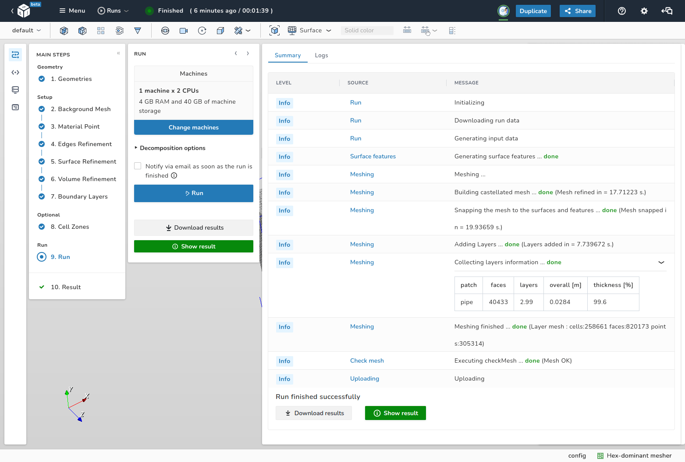
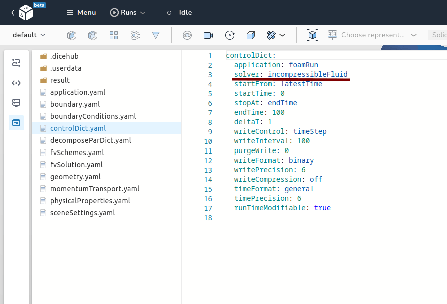

# 🚀 0.10.8 (2022-09-04)

## Features

### Read-only/Presentation mode for applications

<iframe src="https://player.vimeo.com/video/746718327?h=3dc378246e&amp;badge=0&amp;autopause=0&amp;player_id=0&amp;app_id=58479" frameborder="0" allow="autoplay; fullscreen; picture-in-picture" allowfullscreen style="position:absolute;top:0;left:0;width:100%;height:100%;" title="read_only_mode"></iframe>

A new application sharing mode has been added: the "read-only" mode. You can now
share your application with others and decide whether to allow them to
edit the application, launch machines or not. This is especially useful for 
training where instructors can share the application and give a presentation.
Students can still enter a "detached" camera mode if they want to inspect 
something specific and reattach to the instructors camera to continue following
the presentation.

### Run summary

We're pleased to announce that we've added a run summary section to our run 
step. The summary section aims to aggregate all the logs and present them in a 
more comprehensible structure with the most important information.

### Multi-Select and filter by type for boundary patches

<iframe src="https://player.vimeo.com/video/746718280?h=9a5f6872c9&amp;badge=0&amp;autopause=0&amp;player_id=0&amp;app_id=58479" frameborder="0" allow="autoplay; fullscreen; picture-in-picture" allowfullscreen style="position:absolute;top:0;left:0;width:100%;height:100%;" title="multi_select"></iframe>

You can now select several boundary patches and define boundary conditions for 
these patches at the same time. The additional filter helps to select certain types of 
of boundary conditions for a large number of surfaces.

### New template structure for latest OpenFOAM solver modules

In the the [968e60148a](https://github.com/OpenFOAM/OpenFOAM-dev/commit/968e60148ab31ec017f275673496d6193713d7e5) 
commit the modules structure for solvers was introduced. All templates were 
ported to this structure which simplifies further implementation of additional 
solvers and more complex cases.
The new modular solver framework for single- and multi-region simulations now
consists of only 4 main solver modules: isothermalFluid, fluid, 
multicomponentFluid, solid.

## Smaller things and bug fixes

- We fixed the renaming of boundary patches.
- All resources are now visible in the storage.
- The handling of boundary data was fixed.
- All containers were updated to latest Python 3.10.6 version.
- More error messages for failed runs were added.
- You can now submit a bug report directly via image or video.
