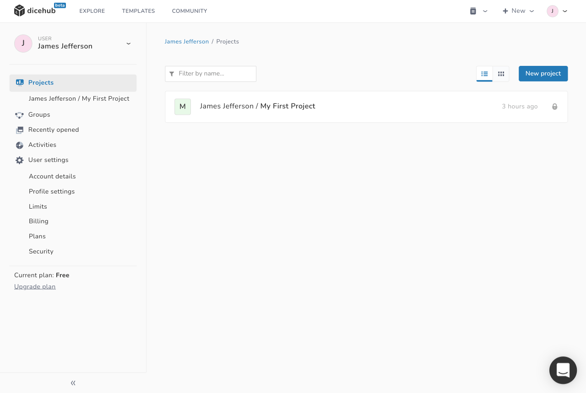
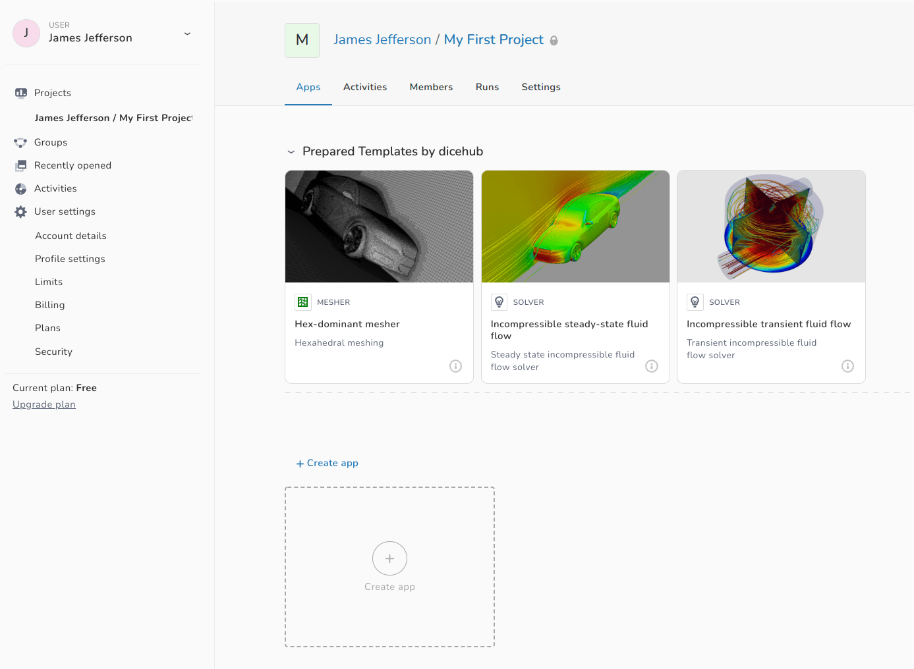
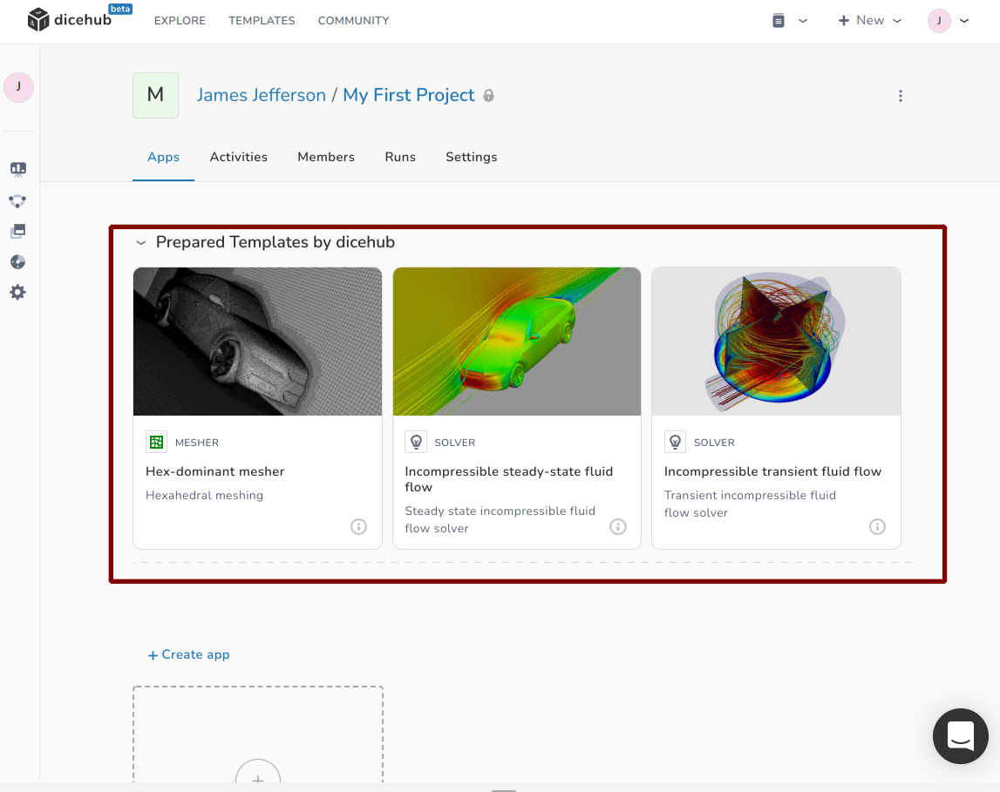
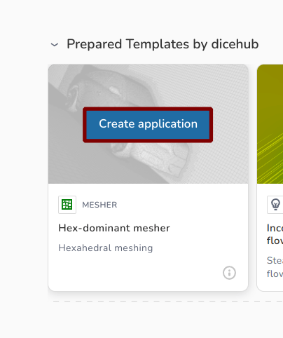

# Create your first application

## Open project

Once you have signed up you can create projects and applications. On your projects
overview page you can already find the first project (**My First Project**) 
that was created for you. You can use this project as your playground and later
go on and create your own projects.

{.zoom .image-wrapper}

Open the project by selecting **My First Project** link. You can now see the
project page where you can create applications for your cases.

{.zoom .image-wrapper}

## Create application from template

All applications are created from templates. You can find some of the prepared 
templates in the upper part of the project page.

{.zoom .image-wrapper}

Select one these templates by moving the cursor over the template card and clicking
on **Create application**

{.zoom .image-wrapper}
