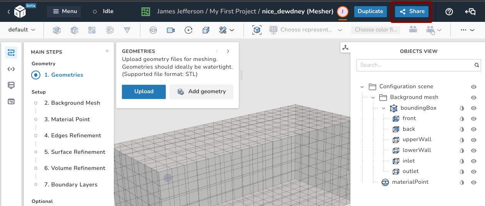
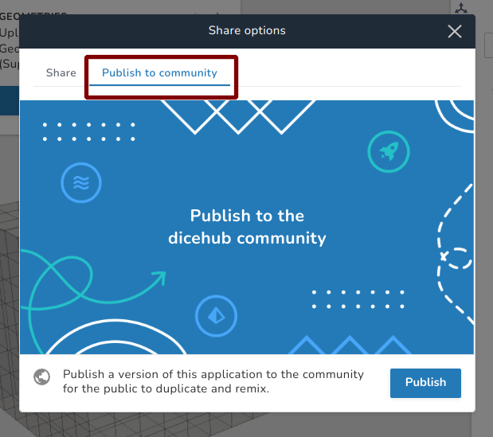
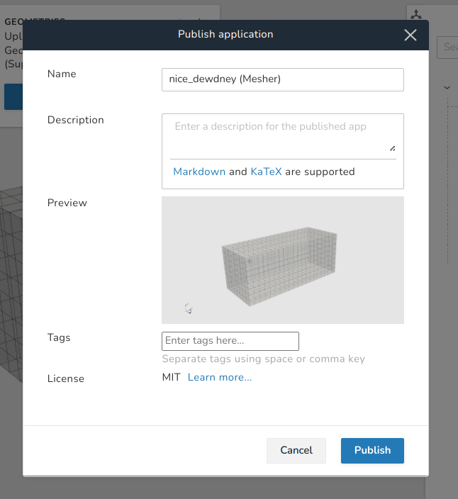
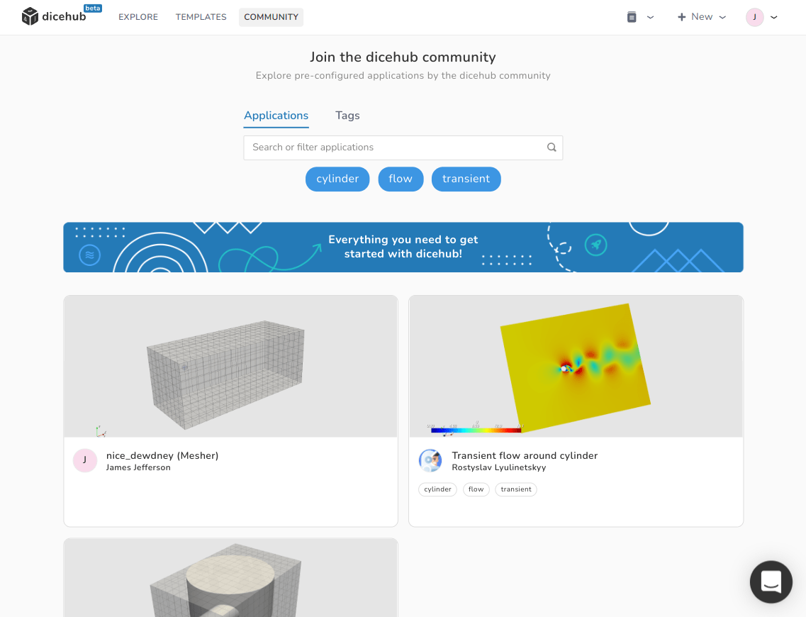

# Applications

## Applications are copies of templates

Applications are essentially copies of templates which you can modify and run.
For example if you created an application based on the **hex-dominant-mesher**
you created a copy of the selected template and by modifying the configuration
you can adjust the default settings of the meshing utility to your requirements.
In most cases your configurations depends on the geometry and the required 
accuracy of your study.

## Create templates from applications for the public

Any application can also again become a template for others. You can setup your
case and publish your application to the community. This way others can use
your template to create their own studies. This can be done by clicking on 
**Share** in the top right corner of your application.

{.zoom .image-wrapper}

Then select **Publish to community** and click on the **Publish** button.

{.zoom .image-wrapper}

Fill out all the required information about your published application/template
and click on the **Publish** button.

{.zoom .image-wrapper}

After the application has been published you can find the application you can
find it publicly available on the dicehub community page.

{.zoom .image-wrapper}

Now any registered user can duplicate the application, adjust the settings and
publish the application again. Users who are not signed up can open the
**Live preview** and inspect the results.
