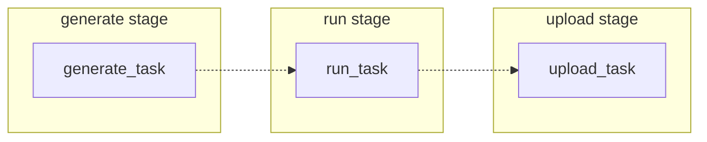

# Flows

<div class="h1-sub">
  Use flows to automate your tasks.
</div>

Flows in dicehub are pipelines that allow to build and automate complex simulation
tasks.
Each task in a simulation run can be customized and run on one or multiple machines.

- [Flow component types](#flow-component-types)
- [Basic flow](#basic-flow)

## Flow component types

A flow has multiple component types to setup a case:

- flow
- service
- task
- stage

## Basic flow

A very simple flow describes multiple stages. Every task is then executed based
on the stage of running flow.




```yaml
---
basic-flow:
  type: flow
  stages:
    - generate
    - run
    - upload

generate_task:
  type: task
  stage: generate
  script:
    - .dicehub/scripts/generate_case.sh

run_task:
  type: task
  stage: run
  script:
    - Background Mesh: .dicehub/scripts/run_openfoam_command.sh "blockMesh"

upload_task:
  type: task
  stage: upload
  where: controller
  script:
    - Uploading: .dicehub/scripts/upload_run.sh
```
