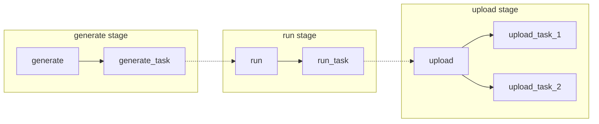

# Flows

<div class="h1-sub">
  Use flows to automate your tasks.
</div>

Flows in dicehub are pipelines that allow to build and automate complex simulation
tasks.
Each task in a simulation can be customized and run on one or multiple machines.

On this page you can find more information about these topics:

- [Flow component types](#flow-component-types)
- [Basic flow example](#basic-flow-example)

## Flow component types

A flow has multiple component types to setup a case:

- **flow**: A flow is a set of stages to be executed during the run.
- **stage**: Flows can be organized into stages, for example "download all case files" or "prepare the geometry". 
  Stages can run in parallel. 
- **task**: A task is a set of commands to be executed in one specified stage.
- **service**: A service is similar to a task except that it can stay in the background during the whole flow. 
This is useful when a service is needed to monitor the progress of a task.

## Basic flow example

A very simple flow describes multiple stages. Every task is then executed based
on the stage of a running flow.



Example for the `/.dicehub/dicehub-flow.yml` file with the flow configuration matching the diagram:

```yaml
basic-flow:
  type: flow
  stages:
    - generate
    - run
    - upload

run_task:
  type: task
  stage: run
  script:
    - echo "This task starts a run with the data from the previous stage"

upload_task_1:
  type: task
  stage: upload
  script:
    - echo "This task uploads the result to the storage"

upload_task_2:
  type: task
  stage: upload
  script:
    - echo "This task uploads something else to the storage simultaneously to the upload_task_1"
```
