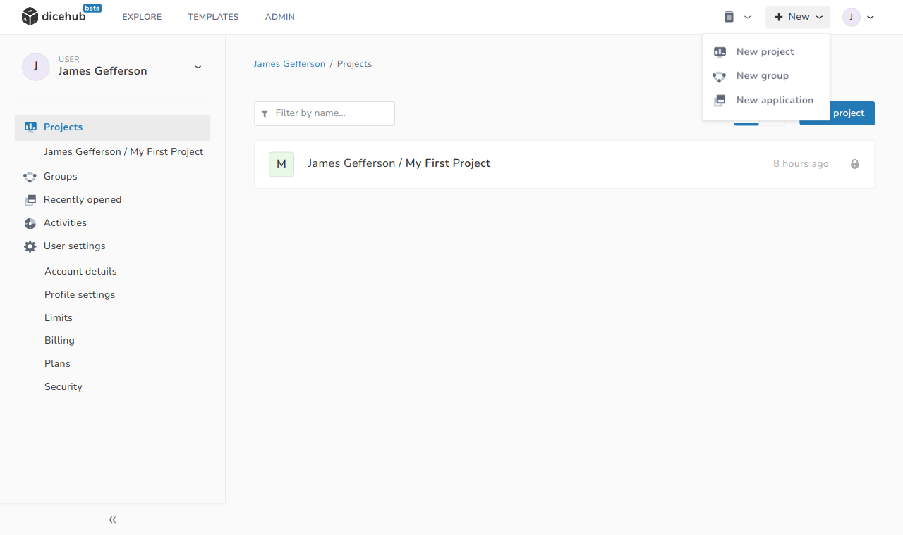
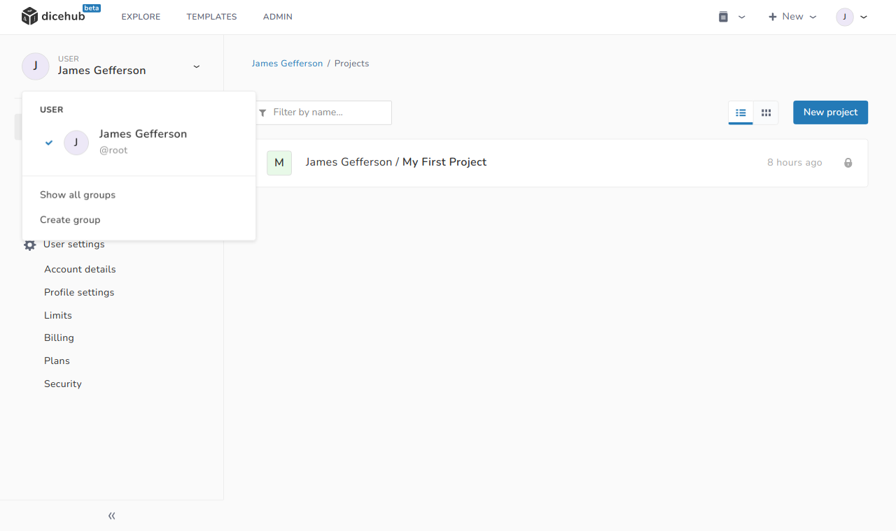

# Groups

  Use groups and subgroups to organize projects.

In dicehub, groups are intended to be used as a logical separation of your projects.

Groups and subgroups can be used to organize complex environments in larger organizations. 

Things related to a group on this page:

- [Create a group](#create-a-group)

## Create a group

Projects can be used for work on a specific topic (for example "Car aerodynamics"). 
In a project you can create applications to solve your simulation problem.

To create a project in dicehub:

=== "Description"
      1. In the main header, click on **+New** (or click in the left navigation on your username and select **Create group** from the dropdown menu).
      1. Select **New Group**.
      1. On the **New Group** page, edit the following details:
           - **Group name**: This is the name of your group. You can use spaces, hyphens and underscores. Special characters are not allowed.
           - **Group namespace**: The namespace is used as the path in your project URL. (The project slug is automatically generated when you type in the project name. You can change the slug after you have selected the project name)
           - **Group description**: Give a short description to explain what the group is for.
           - **Group visibility**: The visibility level determines who can see your group.
      1. Select **Create group**.

=== "Images"
    <figure Markdown>
      {: .zoom .image-wrapper loading=lazy }
      <figcaption>Create group from header</figcaption>
    </figure>
    <figure Markdown>
      {: .zoom .image-wrapper loading=lazy }
      <figcaption>Create group from left user navigation</figcaption>
    </figure>
