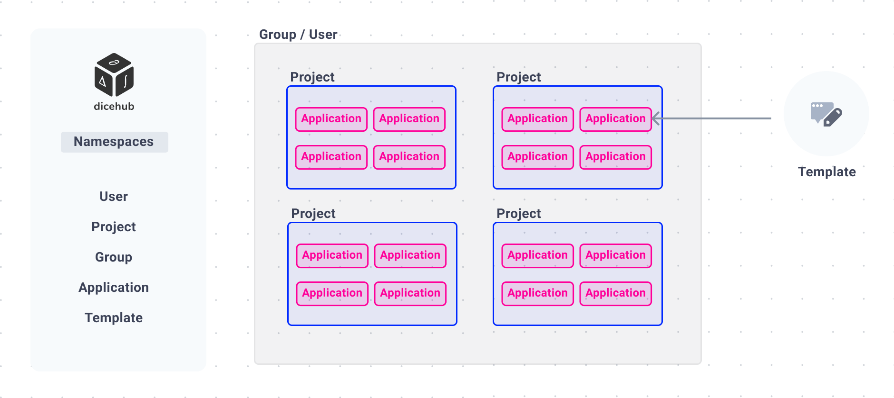

# Overview

In dicehub you can encounter many concepts you may already know from your favorite code collaboration tool such as GitLab or GitHub. 
You may find the basic structure of `namespaces`, `groups` and  `projects` very similar yet some things are more focused on the simulation workflow and a template-based approach.

The dicehub environment can be divided into the following spaces:

- Namespaces
- [Projects](./projects.md)
- [Groups](./groups.md)
- [Templates](./templates.md)
- [Applications](./applications.md)

{: .zoom}

## Template-based approach

In dicehub your application is based on a template. A template consists of pre-defined [flows](./flows.md) and 
some resources (STL files, meshes, scripts, documents, images). This approach was selected to have a workflow oriented solution 
which can easily be adapted to any specific problem. Adding more and more features to a large application leads to a significant increase in difficulty of use. To avoid this, the template-based approach allows a large problem to be divided into many small parts and keep the setup simple.

Compared to an all-in-one application the advantages and disadvantages for the template-based approach are the following:

**Advantages**:

- Smaller reproducible steps
- Quicker setup
- More efficient for specific types of problems, for example meshing
- Simple User Interface and User Experience
- Less prone to errors
- Easier to automate steps and create optimization loops
- Many problem oriented templates

**Disadvantages**:

- More user interfaces to use and get familiar with to solve one relatively simple problem.  
  For example to create a fluid flow simulation
  you need to first create an application for meshing and then export the result to the next fluid flow application.  
  To solve this issue dicehub uses its custom standardized UI and offers shortcuts for exporting and creating applications.
- Too many templates for one problem could become an issue, especially with contributions from 3rd parties.
