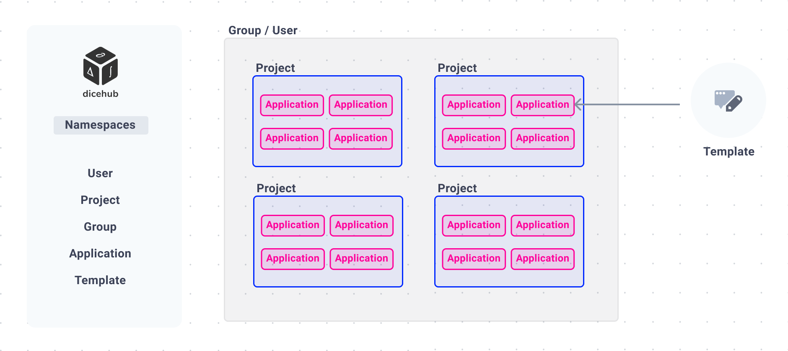

# Namespaces

{: .zoom}

In dicehub you can encounter many concepts you may already know from your favorite code collaboration tool such as GitLab or GitHub. 
You may find the basic structure of `namespaces`, `groups` and  `projects` very similar yet some things are more focused on the simulation workflow and a template-based approach.

The dicehub environment can be divided into the following spaces:

- [Projects](./projects.md)
- [Groups](./groups.md)
- [Templates](./templates.md)
- [Applications](./applications.md)
