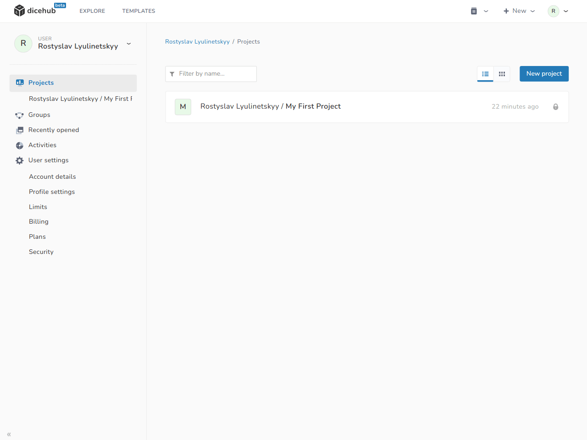
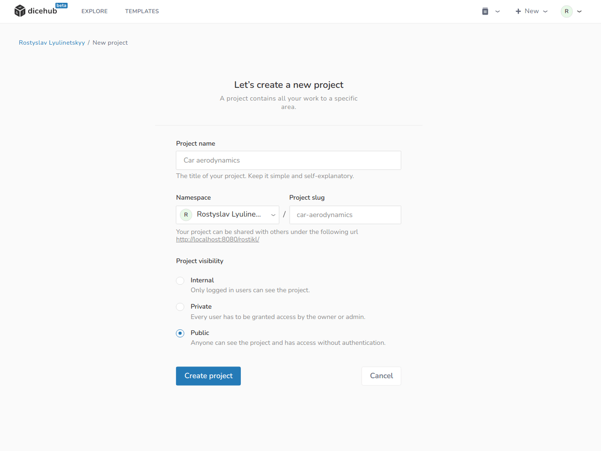
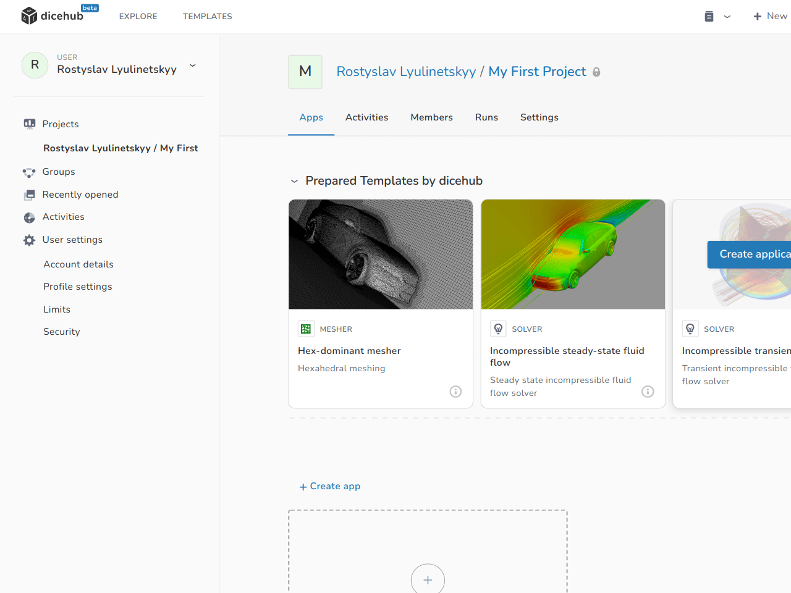
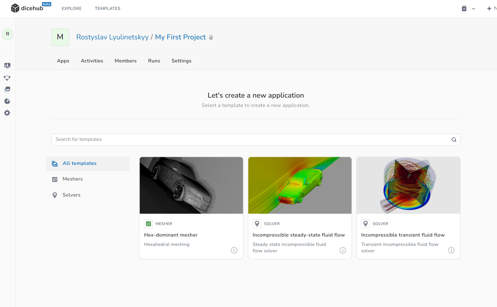

# Projects

  Use projects to group all things related to your domain.

A dicehub project is a space where you can find all the things related to a specific problem. 
Projects contain applications and can be shared with other users by adding them as members.

Things you can do in a project:

- [Create a project](./#create-a-project)
- [Create an application](./#create-an-application)
- [Create a group](./#create-a-group)

## Create a project

Projects can be used for work on a specific topic (for example "Car aerodynamics"). 
In a project you can create applications to solve your simulation problem.

To create a project in dicehub:

=== "Description"
      1. In the left navigation, select **Projects**.
      1. Select **New Project**.
      1. On the **New Project** page, edit the following details:
           - **Project name**: This is the name of your project. You can use spaces, hyphens and underscores. Special characters are not allowed.
           - **Project slug**: The slug is used as the path in your project URL. (The project slug is automatically generated when you type in the project name. You can change the slug after you have selected the project name)
           - **Project visibility**: The visibility level determines who can see your project.
      1. Select **Create project**.

=== "Images"
    <figure Markdown>
      {: .zoom .image-wrapper loading=lazy }
      <figcaption>User dashboard / projects page</figcaption>
    </figure>
    <figure Markdown>
      {: .zoom .image-wrapper loading=lazy }
      <figcaption>Create project page</figcaption>
    </figure>

## Create an application

=== "Description"
      1. Open a **Project**.
      1. Select **New Application**.
      1. On the **New Applications Page**: Select application template.

=== "Images"
    <figure Markdown>
      {: .zoom .image-wrapper loading=lazy }
      <figcaption>Project applications overview</figcaption>
    </figure>
    <figure Markdown>
      {: .zoom .image-wrapper loading=lazy }
      <figcaption>Select application template</figcaption>
    </figure>

## Inspect activities

...

## Add members to your project

...

## Monitor computational runs

...
