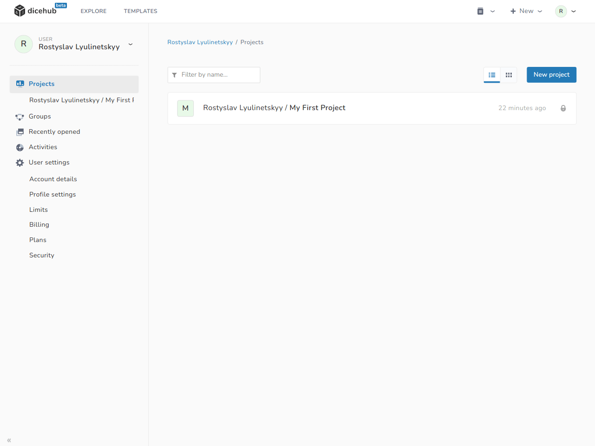
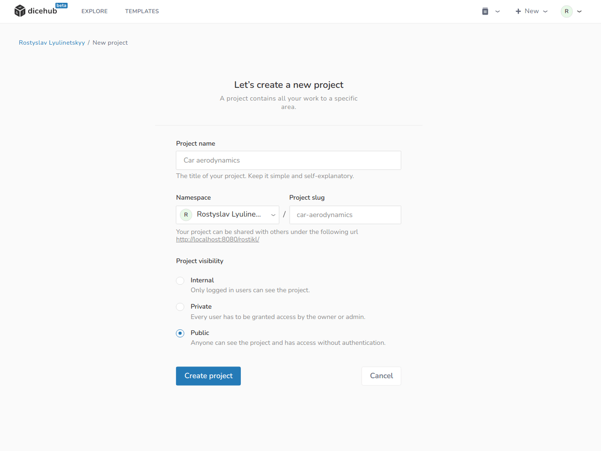
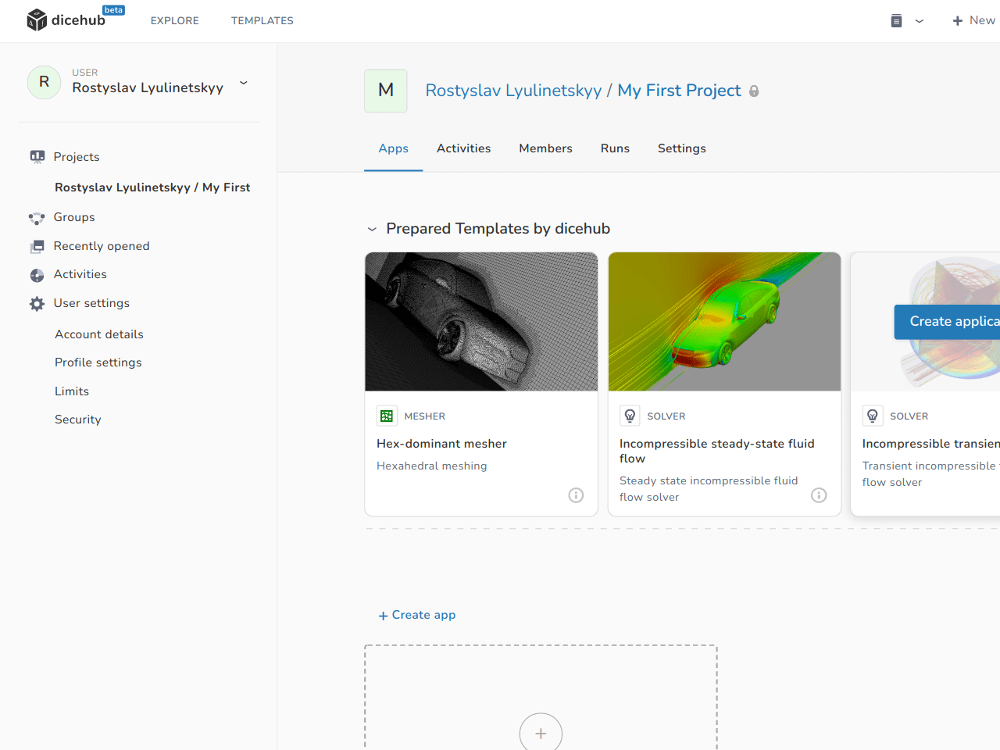
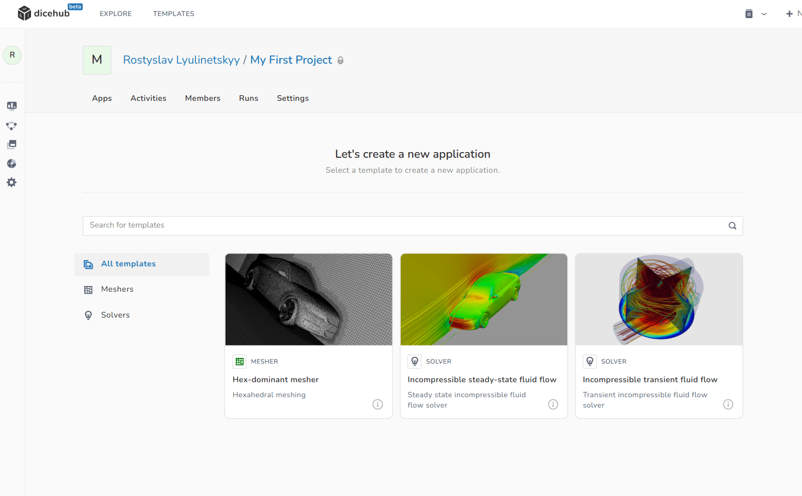
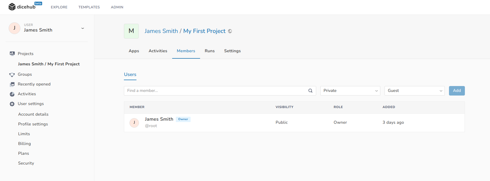
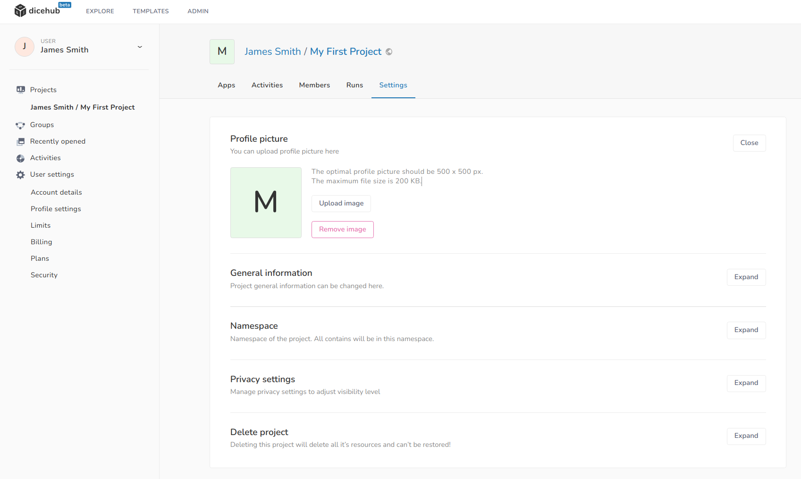

# Projects

  Use projects to group all things related to your domain.

A dicehub project is a space where you can find all the things related to a specific problem.

Projects contain applications and can be shared with other users by adding them as members.

Things related to a project on this page:

- [Create a project](#create-a-project)
- [Create an application](#create-an-application)
- [Add members to your project](#add-members-to-your-project)
- [Remove members from your project](#remove-members-from-your-project)
- [Change project settings](#change-project-settings)

## Create a project

Projects can be used for work on a specific topic (for example "Car aerodynamics"). 
In a project you can create applications to solve your simulation problem.

To create a project in dicehub:

=== "Description"
      1. In the left navigation, select **Projects**.
      1. Select **New Project**.
      1. On the **New Project** page, edit the following details:
           - **Project name**: This is the name of your project. You can use spaces, hyphens and underscores. Special characters are not allowed.
           - **Project slug**: The slug is used as the path in your project URL. (The project slug is automatically generated when you type in the project name. You can change the slug after you have selected the project name)
           - **Project visibility**: The visibility level determines who can see your project.
      1. Select **Create project**.

=== "Images"
    <figure Markdown>
      {: .zoom .image-wrapper loading=lazy }
      <figcaption>User dashboard / projects page</figcaption>
    </figure>
    <figure Markdown>
      {: .zoom .image-wrapper loading=lazy }
      <figcaption>Create project page</figcaption>
    </figure>

## Create an application

=== "Description"
      1. Open a **Project**.
      1. Select **New Application**.
      1. On the **New Applications Page**: Select application template.

=== "Images"
    <figure Markdown>
      {: .zoom .image-wrapper loading=lazy }
      <figcaption>Project applications overview</figcaption>
    </figure>
    <figure Markdown>
      {: .zoom .image-wrapper loading=lazy }
      <figcaption>Select application template</figcaption>
    </figure>

## Add members to your project

To view, add or remove members in your project, open your project and 
go to the **Members section**.

{: .zoom .image-wrapper loading=lazy }

To add a member to the project:

1. Go to **Project > Members**.
1. In the input field with the label `Find a member` type the username or email of the person you want to add.
1. Select the **Visibility level** and **Role**.
1. Click on **Add**.

## Remove members from your project

To remove a member from the project:

1. Go to **Project > Members**.
1. Click on the **Remove button** next to the user you would like to remove.

## Change project settings

You can access the project settings by selecting the **Settings** tab in your project.

{: .zoom .image-wrapper loading=lazy }

The following settings can be changed:

- **Profile picture**: The image to identify your project.
- **General information**: The general information of the project such as title and description can be changed here.
- **Namespace**: Namespace of the project. All contents of the project are in this namespace.
- **Privacy settings**: Here you can manage privacy settings by adjusting the visibility level.
- **Delete project**: Deleting this project deletes all its resources and can not be restored.
