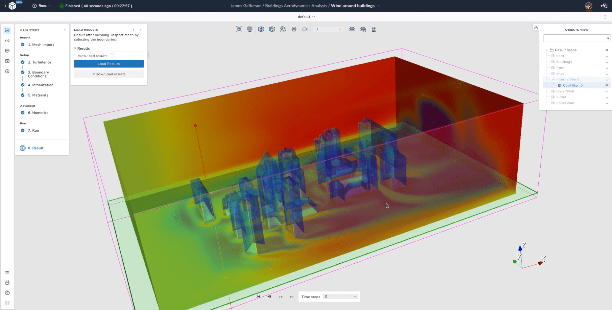

# Getting Started

Welcome to the official [dicehub](https://about.dicehub.com) documentation.

## Overview

| Topic                                             | Description                                                                         |
| :------------------------------------------------ | :---------------------------------------------------------------------------------- |
| [**Quick Start**](./quick_start.md) | A quick introduction to dicehub with a simple meshing example                                                    |
| [**Essentials**](./essentials/namespaces.md)           | Main concepts and features explained in an understandable way for all dicehub users |
| [**Pricing**](./pricing/plans.md)           | The current pricing structure for dicehub services |

---

## What is dicehub?

dicehub is a real-time collaborative CFD (Computational Fluid Dynamics) simulations platform which simplifies your engineering workflow, offers massive parallel scaling and runs in your browser. It provides an easy to use interface to efficiently prepare and conduct simple or complex simulation studies.

Here is an example for a simple fluid dynamics simulation:

{: .zoom .image-wrapper}

The above example demonstrates a couple of core dicehub features:

- **External aerodynamics**: dicehub provides a template to create an incompressible steady state fluid flow simulation in a couple of steps.
- **Visualization**: A powerful visualization engine based on The Visualization Toolkit (VTK) and WebAssembly allows users to inspect data even up to 12 GB in size.
- **UI/UX**: The interface is designed to simplify the main steps to create a simulation without sacrificing the ability to do more complex workflows.

These are just a few features that dicehub offers. More features are explained in other parts of this documentation.

## The Simulation Operations Platform

dicehub is a simulation operations platform that includes most of the common features needed to create simulation workflows. At the current stage of development dicehub focuses on Computation Fluid Dynamics (CFD), but the template-based approach allows an implementation of any other simulation type such as structural dynamics, computer vision or machine learning.  

The current version of dicehub can be used in the following way:

- Visualizing large STL (STereoLithography) files or meshes in the browser
- Creating hex-dominant meshes
- Conducting incompressible steady state fluid flow simulations
- Sharing your results with other simulation engineers around the world
- Collaborating with other simulation engineers in real-time
- Running massive parallel simulations on multiple machines
- Manipulating flows to automate your simulation workflows
- Managing permissions and roles in projects and groups

Other notable features include:

- dicehub is a cloud-native application
- No cloud-vendor lock-in. You can run dicehub on any cloud provider 
  or HPC center.
- Simple local deployment with docker.

## Our goals

- **Simulation Democratization**: to build a community with focus on simplifying and reducing the barrier of entry for all types of simulations.
- **Reproducibility**: allow an easy way to reproduce and share your simulation results.

{: .zoom .image-wrapper }

## Importance of simulations

In recent years expensive experiments have been more and more replaced by virtual 3D simulations in multiple industries (for example in the automotive industry, aerospace industry, chemical industry). This has significantly reduced production costs and resulted in new product innovations. The main driver is the emergence of the new simulation and optimization applications which model processes such as aerodynamics and thermodynamics and predict the experimental results accurately thereby allowing a faster product development. Such applications have become the most important tools of an engineer/scientist. dicehub tries to lower the barrier for the use of these applications and enable a level of simulation democratization not seen before in engineering.

{: .zoom }

## Is dicehub the right solution for you?

As with everything: **It depends**. 

There are many other software solutions, libraries and platforms out there. Each one has features that might help you solve you current problem. The best way to find out if dicehub is something you might need in your workflow is to try to create a simple simulation example, test some of the functions dicehub offers and go on to more complex cases which you are trying to solve. dicehub is still in early stages of development, so the amount of solvers is limited for right now. If you are an expert CFD simulation engineer you are probably better suited with the tools you already know, but dicehub could be an additional tool to share and showcase your results. The possibility for dicehub to quickly evolve, add new templates and workflows, is what allows us to customize it to your needs, and offer you solutions that may not be available right now.
