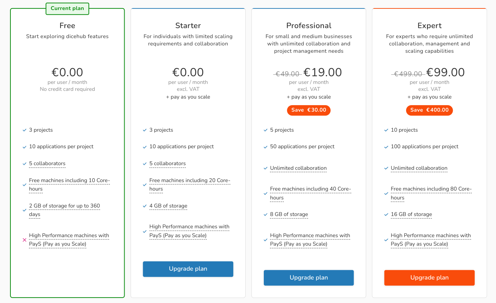

# Plans

  Information about plans and pricing.

Here you can find general information about different plans, pricing 
and billing.

!!! important
    Please keep in mind that dicehub is still in beta.
    The following plans and the pricing structure is subject to change. We are
    always open for suggestions and welcome any feedback from dicehub users.

## Free plan

For users who sign up and want to test the dicehub capabilities without any advanced features

- Costs **€0.00**
- No credit card is required.
- You can create up to 3 projects and in each project up to 10 applications.
- Collaboration is limited to 5 users at the same time.
- You receive a 10 Core-hours limit for free machines per month.
- Your storage is limited to 2 GB for all projects in your namespace.
- ❌ High performance machines are not enabled in this plan.

## Paid plans

dicehub offers 3 paid plans which include different features and options:

### Starter

For individuals with limited collaboration and scaling requirements.

- Costs **€0.00** (+ pay as you scale)
- Credit card and billing information is required
- You can create up to 3 projects and in each project up to 10 applications.
- Collaboration is limited to 5 users at the same time.
- HPC is enabled.
- You can use additional machines and storage.
- You receive a 20 Core-hours limit for free machines per month. Any usage 
  above the limit or the use of the High Performance Machines for your calculations 
  with more CPU cores, RAM, etc., is billed by the second.
- Your storage is limited to 4 GB for all projects in your namespace.

### Professional

Ideal for small and medium businesses with higher collaboration and project management needs.

- Costs **€19** (~~€49~~) per editor/manager per month (+ pay as you scale). Guests are free.
- You can create up to 5 projects and in each project up to 50 applications.
- You have unlimited collaboration.
- You receive a 40 Core-hours limit for free machines per month. Any usage 
  above the limit or the use of the High Performance Machines for your calculations 
  with more CPU cores, RAM, etc., is billed by the second.
- Your storage is limited to 8 GB for all projects in your namespace.

### Expert/Enterprise

For experts and organizations who require unlimited collaboration, management and scaling capabilities.

- Costs **€99** (~~€499~~) per editor/manager per month (+ pay as you scale). Guests are free.
- You can create up to 10 projects and in each project up to 100 applications.
- You have unlimited collaboration.
- You receive a 80 Core-hours limit for free machines per month. Any usage 
  above the limit or the use of the High Performance Machines for your calculations 
  with more CPU cores, RAM, etc., is billed by the second.
- Your storage is limited to 16 GB for all projects in your namespace.
- In Enterprise plan: you can create 10 groups, 3 teams and 10 subgroups per group.

For up to date information for the different plans go to `User/ Group Settings` and select `Plans`.

---

## HPC Machines

A dicehub machine is a computational resource in the cloud (for example a virtual or dedicated server). 
When you specify the amount of cores and nodes a small cluster of 
servers where your calculation is executed, is assigned to you .

The following machines are available on dicehub.com:

| Machine        | Description                                                                                                                                | Cores | Cost        |
| -------------- | ------------------------------------------------------------------------------------------------------------------------------------------ | ----- | ----------- |
| dh1_1x         | 4 GB RAM, 20 GB of machine storage                                                                                                         | 1     | €0.17/hour  |
| dh1_2x         | 4 GB RAM, 40 GB of machine storage                                                                                                         | 2     | €0.34/hour  |
| dh1_4x         | 21 GB RAM, 80 GB of machine storage, Network performance up to 25 Gigabit                                                                  | 4     | €1.60/hour  |
| dh1_8x         | 42 GB RAM, 160 GB of machine storage, Network performance up to 25 Gigabit                                                                 | 8     | €3.15/hour  |
| dh1_18x        | 96 GB RAM, 360 GB of machine storage, Network performance up to 50 Gigabit, Elastic Fabric Adapter (EFA) is enabled                        | 18    | €7.10/hour  |
| dh1_36x        | 192 GB RAM, 720 GB of machine storage, Network performance up to 100 Gigabit, Elastic Fabric Adapter (EFA) is enabled                      | 36    | €14.15/hour |
| dh1_96x        | 384 GB RAM, 1440 GB of machine storage, Network performance up to 100 Gigabit, Elastic Fabric Adapter (EFA) is enabled                     | 96    | €19.82/hour |
| dh1_96x_lustre | 192 GB RAM, 2400 GB of high performance file system lustre, Network performance up to 100 Gigabit, Elastic Fabric Adapter (EFA) is enabled | 96    | €23.41/hour |

## Storage and network traffic

!!! note
    Due to the nature of HPC calculations and their typical size we are forced to
    calculate storage and network traffic and add these items to the bill.

Storage price above the included storage limit: **€0.20/GB-month**

Network traffic: **€0.20/GB**

    

### Is multithreading enabled?

Multithreading in most cases does not significantly improve the solution time for CFD simulations. 
Because of this, for all dicehub machines multithreading is disabled.

## Tax

Please note that all charges to your account are made in EUR. Prices in other currencies are provided as a convenience and are only an estimate based on current exchange rates. Shown prices are VAT exclusive. VAT are be billed to EU customers in line with the applicable rates of their member state unless a valid VAT number is provided.
