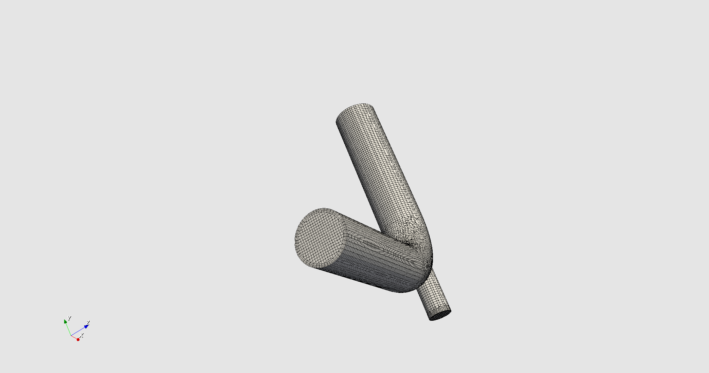

# Getting started

The dicehub documentation is divided into the following topics:

| Topic                                        | Description                                                                         |
| :------------------------------------------- | :---------------------------------------------------------------------------------- |
| [**Quick Start**](./quick_start.md)          | A quick introduction to dicehub with a simple meshing example                       |
| [**Essentials**](./essentials/namespaces.md) | Main concepts and features explained in an understandable way for all dicehub users |
| [**Pricing**](./pricing/plans.md)            | The current pricing structure for dicehub services                                  |
| [**UX/UI**](./ui/user_dashboard_ui.md)       | Explanation about the dicehub user interface                                        |

# Quick Start

  Start with a simple meshing example to get familiar with dicehub.

To start with something simple open the following meshing example by clicking on the image below:

{target="_blank"}
Or click the following link: [Open example](https://dicehub.com/api/v1/app_preview/178){target="_blank"}

<!-- 

  

 -->

In the **Results**-Step you can click on **Load results** and inspect the calculated mesh of the mixing elbow geometry.

In this meshing examples you can also play around with different parameters such 
as surface refinement, boundary layers and edge refinement to see how they affect 
the resulting mesh.
