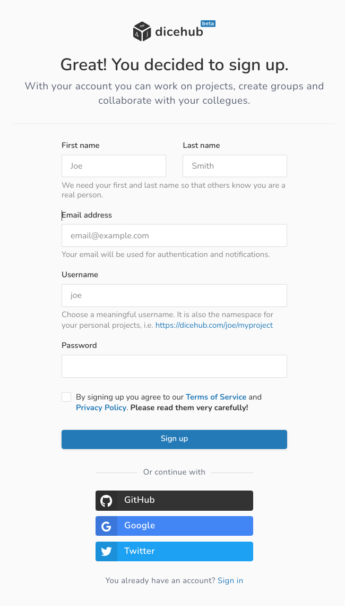
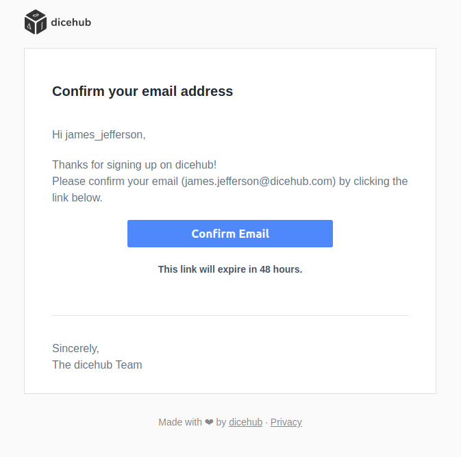

# Sign up for an account

To fully utilize dicehub you need to [sign up for an account](https://dicehub.com/signup). 

Your account will be on the [**Free plan**](../guide/pricing/plans.md#free-plan).
In this plan you can use 10 Core-hours every month to conduct your CFD analysis.

## Sign up

Fill in your first/last name, email address and username, choose your password, 
confirm that you agree with our terms of service and privacy policy and click on
the **Sign up** button.

{.zoom .image-wrapper}

You will now be redirected to your **Project overview** page. There you will find
your first project: *My First Project*.

## Verify your email address

After the sign up you will receive an email to verify your email address. Check 
for an email with the subject line **"[dicehub] - Please confirm your email address!"** 
in your inbox.

{.zoom .image-wrapper}

If you can not find the email in your inbox please check your spam folder.
To resend the confirmation email go to your **User settings**, click on the
**Account details** section and select the **Emails** tab. There you can click
on the button to resend the confirmation email.
