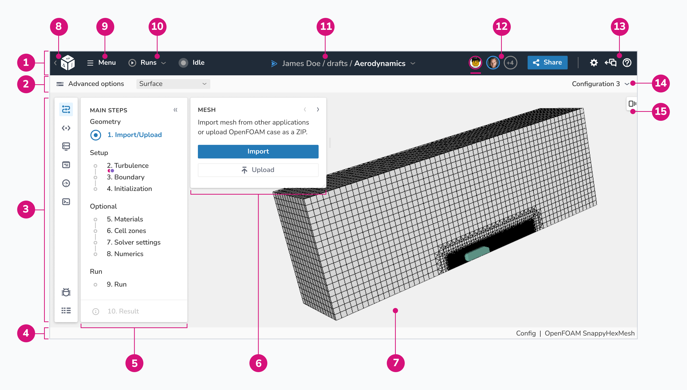

# Application UI

The application UI is designed to be as simple as possible and give the user
a clear step by step instruction on how to setup and run a case.

The application UI in dicehub has the following elements:

{: .zoom .image-wrapper loading=lazy }

1. **Global navigation:** main navigation with most important global functions,
   information about the current application and the presence of other 
   collaborators.
1. **Toolbar:** a group of menus and controls to allow quick access to functions 
   that are commonly used in the application.
1. **Side navigation:** A vertical list of navigational links to global dicehub
   domains. In this navigation you can find:
      - **Main steps:** Functions of the applications, broken down into most
        most important individual steps.
      - **Configurations:** stack of different versions (configurations) for 
        the application.
      - **Storage:** The place for all the files (configurations, snapshots, 
        resources and results) for the application.
      - **Configurations editor:** Editor for all configuration files which 
        describe the [dicehub flow](./../essentials/flows.md) of the application.
      - **Application information:** All the information about the application
        such as namespace, project id, application id. (Intended for debugging)
      - **Keyboard shortcuts**: A list which describes combinations of keystrokes 
        on a computer keyboard which invokes most common commands.
1. **Footer:** bottom section of the application which contains useful 
  information about the application:
     - The loading state 
     - The name of the active 3D visualization scene
     - The name of the active template
1. **Main steps:** A visual representation of progress through the steps to 
  complete a necessary process, in most cases to configure and run a dicehub 
  flow. Common categories for the tasks can include:
     - **Geometry:** A geometry is uploaded or imported from another application. 
     - **Setup:** Main steps to configure the application, for example
       turbulence model or boundary condition selection.
     - **Optional:** Settings which are not required for a successful run.
     - **Run:** customizable settings for the machines where the run is deployed 
       and executed.
     - **Result:** Result of a successful run can be inspected and downloaded here.
1. **Step controls:** content block which show settings for each step.
1. **3D scene view**: Main 3D scene. (The name of the active scene view is shown
  in the bottom right corner in the footer, for example "Config" or "Result")
1. **Logo:** is a visual representation of dicehub to promote public identification. This logo redirects you to your dashboard.
1. **Main application menu:** global application menu with access to advanced options.
1. **Application state indicator:** includes the current state of the run and a 
menu to all current and previous run in the application
1. **Application name:** shows the namespace and title of the application. The
   dropdown menu allows switching between applications without going back to the
   projects page.
1. **User avatars:** Group of user avatars that are online at this moment.
1. **Utilities:** the global system-level utilities in the application. They open 
   panels that provide access to other places in the application. Utilities include:
   - **Settings:** application main settings such as colormap or views.
   - **Chat:** online chat, which provide a real-time transmission of text messages.
   - **Help:** help information about the content in the application.
1. **Objects view:** panel with additional controls for the 3D scene.
