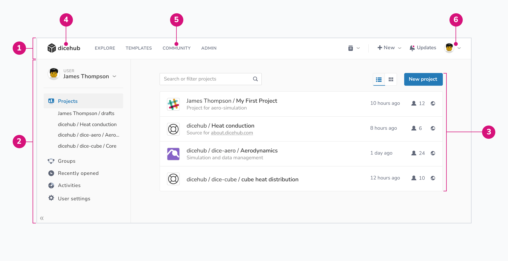

# User dashboard

In dicehub, the user interface was designed to be as simple as possible and at
the same time allow a very fast workflow.

The user dashboard in dicehub has the following elements:

{: .zoom .image-wrapper loading=lazy }

1. **Global navigation**: a consistently available user interface element that used for global navigation and provides access to system-wide functions.
1. **Side navigation**: a vertical list of navigational links. In this navigation you can find:
     - **Projects**: List of projects you have access too.
     - **Groups**: List of groups you have access too.
     - **Recently opened**: A list of recently opened applications.
     - **Activities**: A list of specific events, for example creating an application.
     - **User settings**: Here you can setup your account, profile and manage billing, security and limits.
1. **Main content**: the part of the page which that is unique to that page and can contain different content, such lists, forms, images and other.
1. **Logo**: is a visual representation of dicehub to promote public identification. This logo also represents a link to your dashboard.
1. **Global navigation menu**: is the main navigation on dicehub and includes links to the following pages:
     - **Explore**: A page with all publicly available projects and groups.
     - **Templates**: Publicly available pre-defined templates can be found here.
     - **Community**: In dicehub users can prepare their applications and publish them for the community here.
     - **Admin**: This section is only available for administrators on self-managed servers.
1. **User menu**: menu where you quickly find a link to your user settings, your public profile and a link to sign out.
