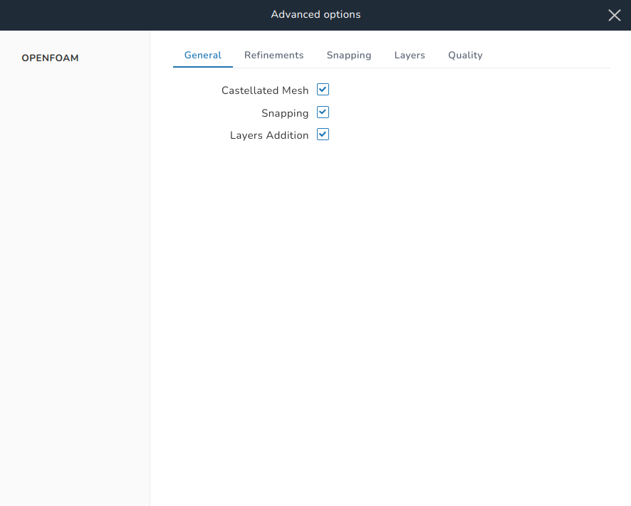
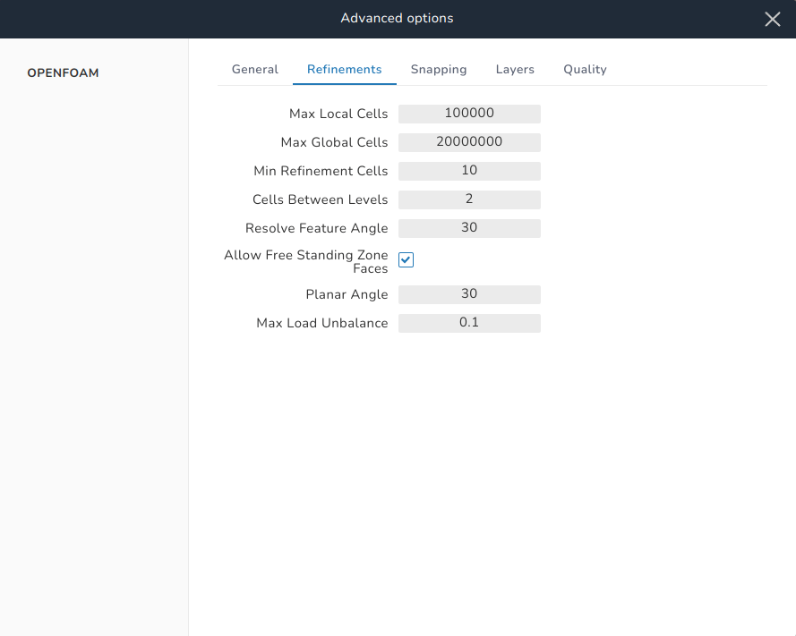
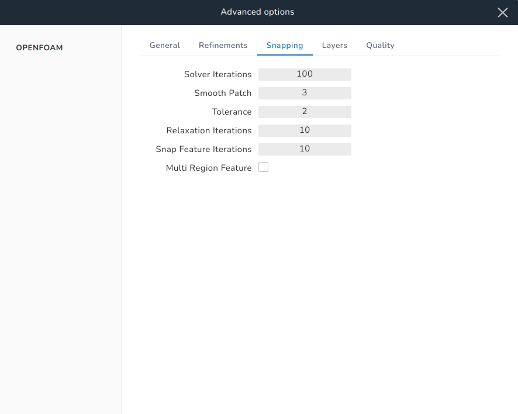
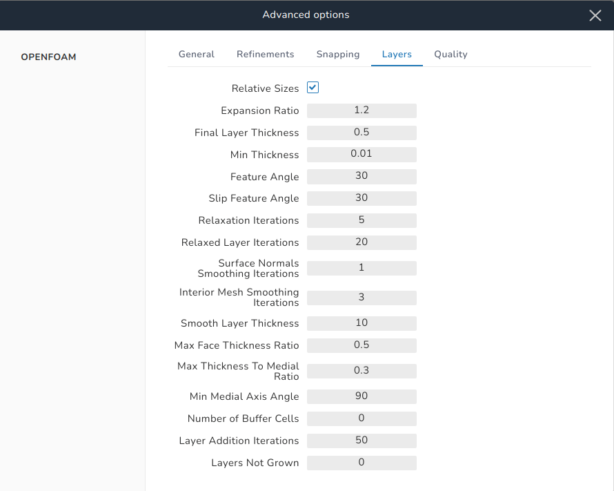
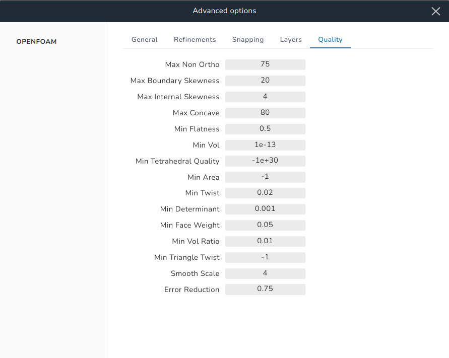

# Advanced options

This group of menus provide some global advanced options for the **Hex-dominant mesher**.

## General

{ .zoom .image-wrapper }

In this menu, there exist three checkboxes to enable or disable the execution of the main steps of the meshing engine:

- Castellated mesh, which performs cell splitting and refinement of edges, surfaces, and cells.
- Snapping, which snaps the points of the cells that intersect the geometric surface onto the surface to create body-fitted cells.
- Layers addition, which constructs layers of cells on the simulated geometric surface for better capture of boundary layer effects.

## Refinements

{ .zoom .image-wrapper }

In this menu, some options related to the refinement process are specified:

- Max local cells: the maximum number of cells per core.
- Max global cells: the maximum number of cells in the whole domain.

Note: the **max local cells** and **max global cells** are used to control the refinement in the castellated mesh step. In case of serial meshing, both values are the same. The meshing engine will continue refining the cells according to the set refinement criteria until **max local cells** is reached for certain core (this core will not refine anymore with other cores continuing refinement for other sub-domains or the engine would re-balance the loads between the processors and then continue refinement for all sub-domains) or **max global cells** is reached globally.

### Min refinement cells

This specifies the minimum number of cells for a refinement iteration to be executed. The purpose of this value is to prevent the engine from spending a lot of iterations refining a small number of cells.

### Cells between levels 

This specifies the number of layers in a buffer zone between zones of different refinement levels. Increasing this value would create a more gradual change in layers of refinement between zones at the expense of mesh size.

### Resolve feature angle 

In the [surface refinement](./surface_refinement.md) step, a minimum and a maximum levels of refinement are specified. If a cell intersects the geometric surface at an angle greater than the **resolve feature angle** the maximum level of refinement is applied to this cell. Otherwise, the minimum level is applied.

### Allow Free Standing Zone Faces

If this checkbox is ticked then all the faces that intersect a geometric surface are put in a facezone. If it is not ticked, then the geometric surface is checked. If it has a facezone only and no cellzone, then the faces that intersect the geometric surface are put in a facezone. If the geometric surface has both facezone and cellzone, then faces are removed if they are between the same cellzone or on the boundary.

### Planar Angle

This is used to determine if surface normals are the same or opposite. A default value for it would be the **resolve feature angle**.

### Max Load Unbalance

This value will tell the engine how much imbalance between the processors is tolerated. Setting this to 0 will force the engine to balance the loads between the processors.

## Snapping

{ .zoom .image-wrapper }

Some options related to point snapping onto a geometric surface are specified.

### Solver Iterations

This is the maximum number of iterations for the snapping process. More iterations mean better quality but at the expense of computational time.

### Smooth Patch

Specifies the number of iterations for mesh smoothing to make the mesh conforming to the surface.

### Tolerance 

This defines the relative distance from the surface along which the engine would look for points to snap onto the surface. It is defined as a ratio of the length scale of the cell and its minimum value is 1.

### Relaxation Iterations

This specifies the number of relaxation iterations for snapping.

### Snap Feature Iterations

This identifies the iterations limit for snapping points onto the features of a geometric surface.

### Multi Region Feature

Tick this checkbox when dealing with a multi-region mesh so that features between multiple surfaces are captured.

## Layers

{ .zoom .image-wrapper }

The options related to the Layering process are defined here.

### Relative Sizes

By ticking this checkbox, the lengths defined in the [layering section](/boundary_layer.md) are defined relative to the length scale of the grid cell over which the layer is being constructed. Not ticking the checkbox makes the lengths defined absolute.

### Expansion Ratio

This specifies the default global ratio of the geometric progression defining the boundary layer. This value is overwritten by the *expansion ratio* defined per surface in the [layering section](/boundary_layer.md).

### Final Layer Thickness

This is the default global thickness of the final layer of any boundary layer. Also, this value is overwritten by the *final layer thickness* defined per surface in the [layering section](/boundary_layer.md).

### Min Thickness

This is the default global minimum allowable thickness of any boundary layer. Also, this value is overwritten by the *min thickness* defined per surface in the [layering section](/boundary_layer.md).

### Feature Angle

This specifies the maximum angle of a surface features after which the meshing engine does not add a layer at this location. Increasing this value (say to 180 degrees) is suitable to have layers over sharp corners.

### Slip Feature Angle

If the angle between a patch's extrusion direction and its neighbor's exceeds this value, then point sliding on the patch is allowed. The default value is one half of the *feature angle*.

### Relaxation Iterations

The global maximum number of relaxation iterations.

### Relaxed Layer Iterations

Up to this number of iterations, the meshing engine will iterate to satisfy the [quality criteria](#quality). After this number of iterations, if a quality criterion is not satisfied, the engine would use the corresponding relaxation value defined in the [quality section](#quality).

### Surface Normals Smoothing Iterations

This specifies the number of iterations required to smooth the surface normals. 

### Interior Mesh Smoothing Iterations

Specifies the number of iterations for smoothing the directions of mesh motion.

### Smooth Layer Thickness

Specifies the number of iterations to smooth the layer thickness over a patch. 

### Max Face Thickness Ratio

Specifies a limit for the ratio of a layer's face area to its thickness over which the engine will not add a layer to this face so as to avoid highly warped cells.

### Max Thickness To Medial Ratio

If the ratio between a layer's thickness and the medial distance exceeds this value, then the engine reduces the layer growth.

### Min Medial Axis Angle

This specifies the minimum angle for medial axis point selection.

### Number of Buffer Cells

Specifies a buffer region where the number of layers is gradually decreased. If this value is set to less than 0, a terminated layer is stopped right away.

### Layer Addition Iterations

The maximum number of iterations for the layer addition algorithm.

### Layers Not Grown

This specifies the number of layers whose extrusion is cancelled because they are close to features and/or patches where layers are not grown. This is used as a transition between regions of no layers and regions of full number of layers.

## Quality

{ .zoom .image-wrapper }

Some global quality criteria are defined here.

### Max Non Ortho

This specifies the maximum allowable face non-orthogonality angle which is defined as the angle between the actor connecting the centers of two adjacent cells and their common face normal.

### Max Boundary Skewness

This specifies the maximum allowable skewness of a boundary face.

### Max Internal Skewness

This specifies the maximum allowable skewness of an internal face.

### Max Concave

This specifies the maximum allowable cell concavity in degrees.

### Min Flatness

The minimum allowable face flatness which is the ratio between the face's projected area and its actual area.

### Min Vol

This specifies the minimum allowable cell volume.

### Min Tetrahedral Quality

The minimum allowable tetrahedra cells quality.

### Min Area

The minimum allowable face area. If it is set to a negative value, then all face areas are accepted.

### Min Twist

The minimum face twist which is calculated as the dot product of face normal and the face centre triangles normal.

### Min Determinant

The minimum allowable cell determinant. A value of 1 corresponds to a Hexahedron.

### Min Face Weight

The minimum allowable face interpolation weight.

### Min Vol Ratio

When a cell's points are snapped to a surface, if the new volume is larger than this ratio multiplied by the old volume then this cell is deleted. If the ratio is set to a negative value, the cell is always deleted.

### Min Triangle Twist

The minimum allowable triangle twist which is the dot product of consecutive triangle normals resulting from face-centre decomposition.

### Smooth Scale

This specifies the number of smoothing (error distribution) iterations.

### Error Reduction

This represents the amount of scaling back the displacement at error points.
