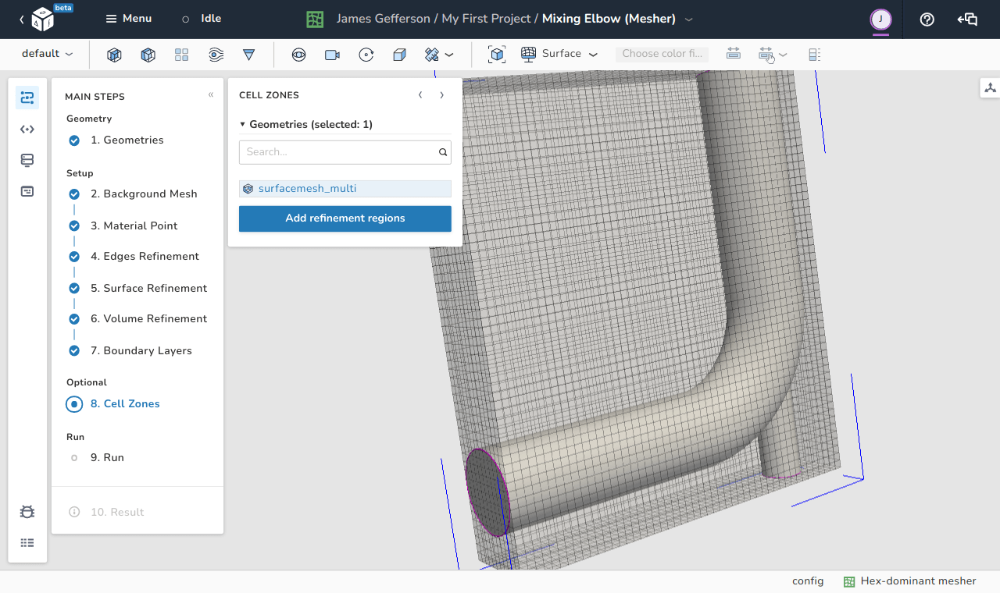

# Cell zones

<figure Markdown>
  { .zoom .image-wrapper }
  <figcaption>View of the cell zones step</figcaption>
</figure>

The cell zones step is an optional step in the Hex-dominant mesher. It is possible to define refinement levels similar to that done in [edges](./edges_refinement.md), [surface refinement](./surface_refinement.md), and [volume refinement](./volume_refinement.md) steps for cells zones as well as defining cell zones.

In this menu, all the global surface (the surface entity that contains all the facets of the STL file) entities of the loaded STL files are listed. For each entity, a refinement level can be specified where the level represents the exponent of $2$ to which a cell is split into.

Similar to the [volume refinement](./volume_refinement.md) step, there are three different types of defining a refinement criteria:

1. **Inside:** for this type, all the cells that lie inside the surface entity are subject to refinement according to the specified level.

1. **Outside:** same as *Inside*, but for cells that are outside the surface entity.

1. **Distance:** all the cells that are within a specific distance from the surface are subject to this refinement. In this option, multiple distances can be applied to make, for example, the cells that are closer to the surface finer than the those that are further. The distances need to be ordered by the closest first, and each distance can have its own level of refinement.

For the *regions* sub-menu:

1. The **enabled** switch can be used to toggle cell zone definition. 
1. **Face type** can be used to specify the type of the faces in this set and has three options:
    - **Internal:** normal internal faces of the mesh with no boundary conditions on them
    - **Baffle:** internal faces that can turn into boundaries according to user definition
    - **Boundary:** normal boundary face
1. **Face zone** specifies the name of the face zone that contains the faces under consideration. By default, the only option is *inside faces*.
1. **Cell zone inside** tells the mesher which region to consider for selecting the faces of the face zone. Since, the STL surface splits the domain into inside and outside regions, we can tell the mesher to only consider one of the two regions. There are three options available here:
    - **Inside:** all the cells that lies inside the STL surface.
    - **Outside:** all the cells that lies outside the STL surface. 
    - **Inside point:** select the regions to which a certain point belongs. This requires defining the coordinates of this point.
