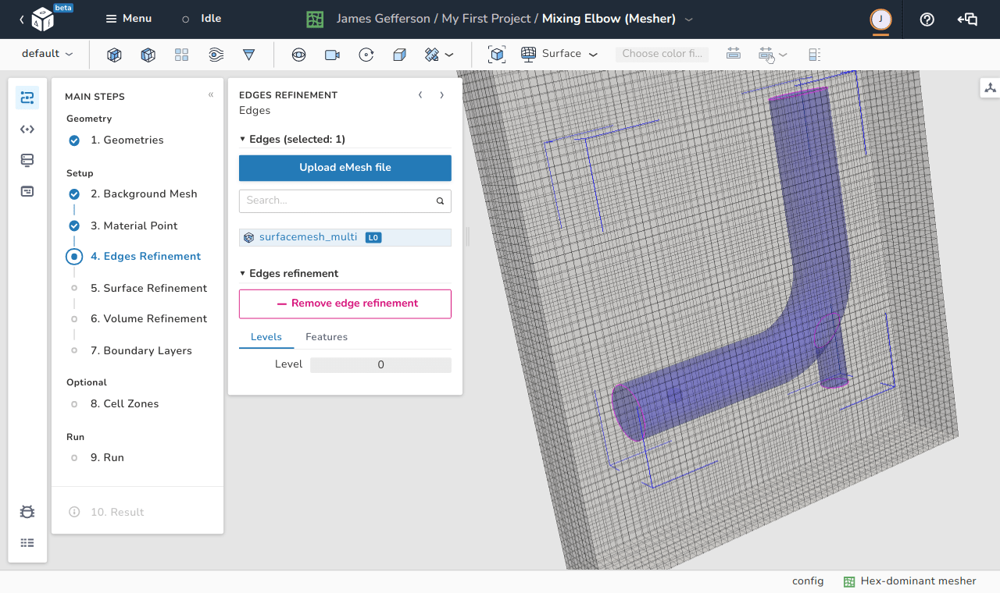

# Edges refinement

In order to preserve the main features of the simulated geometric surface, it is important to inform the meshing utility which edges are important to preserve. These edges are typically sharp edges that give the geometric surface its identity like the circumferences of the two circles defining a cylinder. 

<figure Markdown>
  { .zoom .image-wrapper }
  <figcaption>View of the edges refinement step</figcaption>
</figure>

As shown in the image below, trying to create a mesh inside a cylinder without edge refinement can smear out the cylindrical shape.
