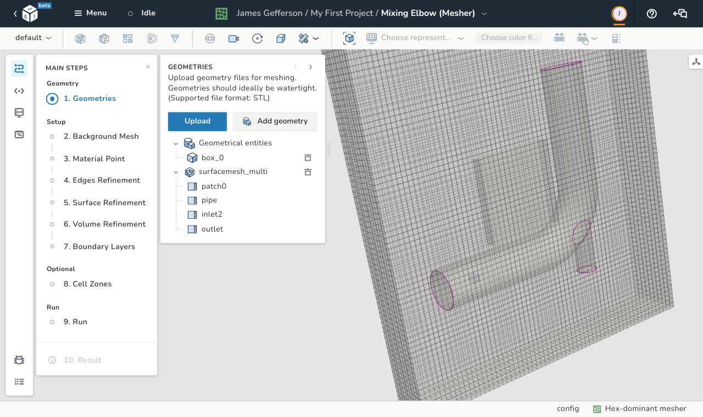
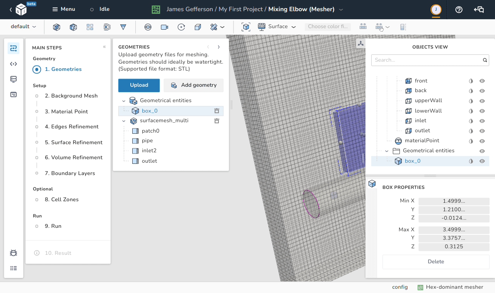
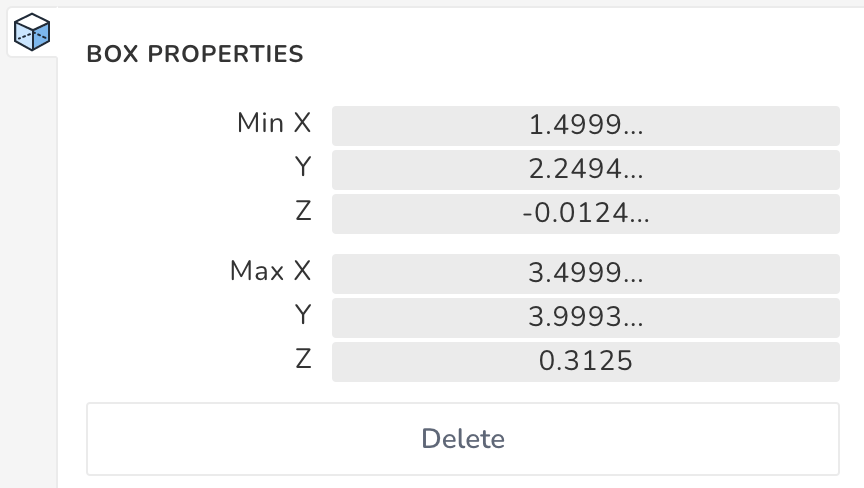
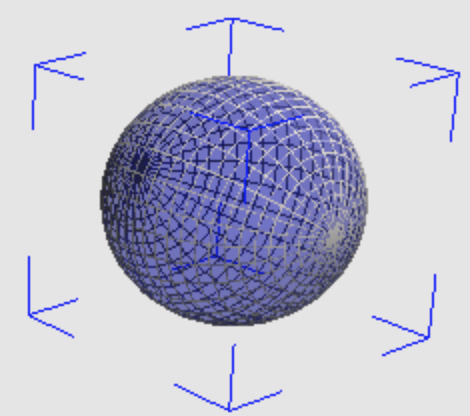
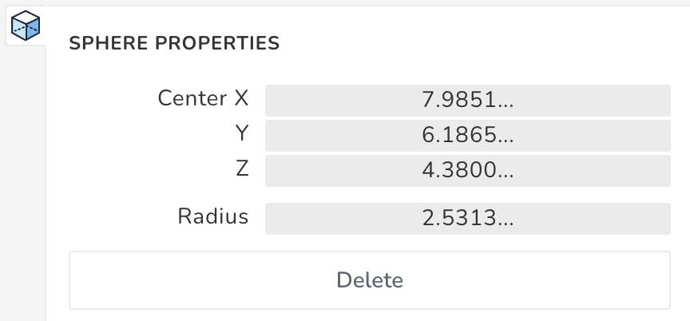
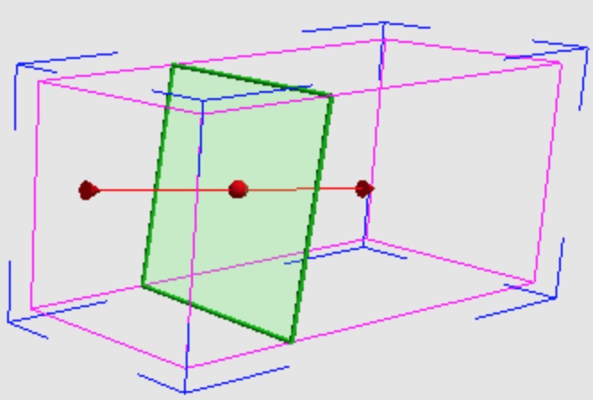
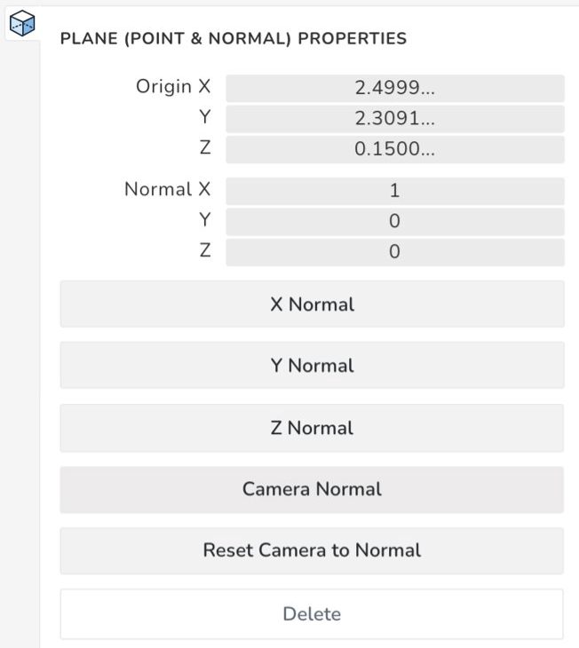

# Geometries

In this step, the geometry used by the hex-dominant mesher is created and/or 
imported to define the regions of interest in the background mesh.

<figure Markdown>
  { .zoom .image-wrapper }
  <figcaption>View of the geometries step</figcaption>
</figure>

## Import geometry

Geometry files are imported in the [STL](https://en.wikipedia.org/wiki/STL_(file_format)) 
format which represents a surface by a set of triangular facets. It is advisable 
that an imported STL file be [watertight](https://knowledge.autodesk.com/support/moldflow-insight/learn-explore/caas/CloudHelp/cloudhelp/2017/ENU/MoldflowInsight/files/GUID-C0DF9415-33E2-4324-9278-61DB76CA3402-htm.html) 
which means that the surface should not have holes, intersections, or unrealistic 
geometric entities. 

!!! tip
    It is not mandatory to use watertight surfaces because the background mesh 
    itself can be used as a seal to cover up the missing facets in the STL but 
    only when the missing facets are oriented parallel to the faces of the 
    background mesh. However, missing facets on curved surfaces may cause 
    meaningless meshes. 

STL files can be uploaded using the **upload** button as shown in the image. 
Any imported STL file can be deleted using the *delete* icon on the right-side 
of every geometric entity in the model.

## Add primitive geometry

Instead of using STL files, some primitive shapes can be imported using the 
**Add geometry** button. Those shapes are:

- Box
- Sphere
- Plane (defined by a point in space and a normal vector)
- Plate

The properties of each added geometric entity can be modified using the 
**objects view**. 

The added geometric entity can also be translated by using the middle button 
of the mouse and has some control points that can be dragged to increase or 
decease the entity's size in a certain direction.

<figure Markdown>
  { .zoom .image-wrapper }
  <figcaption>Object properties in the objects view</figcaption>
</figure>

### Box

|                                                                                       |                                                                                      |
| ------------------------------------------------------------------------------------- | ------------------------------------------------------------------------------------ |
| { .zoom .image-wrapper } | { .zoom .image-wrapper } |

The bounds of an added box can be specified by choosing the coordinates the of 
the minimum and maximum $x$, $y$, and $z$ points as shown in the image. 
Furthermore the shown control points on the right can be used to manually adjust 
the box's size in any direction.

### Sphere

|                                                                                       |                                                                                      |
| ------------------------------------------------------------------------------------- | ------------------------------------------------------------------------------------ |
| { .zoom .image-wrapper } | { .zoom .image-wrapper } |

The size and location of the added sphere can be determined by defining the 
location of its center and the length of its radius.

Dragging the sphere by the right button of the mouse increases/decreases its 
size manually.

### Plane (point and normal)

|                                                                                       |                                                                                      |
| ------------------------------------------------------------------------------------- | ------------------------------------------------------------------------------------ |
| { .zoom .image-wrapper } | { .zoom .image-wrapper } |

The plane entity is defined by a point and a normal vector. The point can be 
any arbitrary point that lies on the required plane, and its location can be 
defined by two methods:

- Explicitly defining the coordinates as shown on the left image.
- Dragging the red point by the mouse as shown on the right image.

The outward pointing normal has multiple options for definition:

- Explicitly, by defining the components of the vector.
- Normal to one of the global axes. There are three available options: 
  **X Normal**, **Y Normal** and **Z Normal**.
- Normal to the current camera view. This option assumes that the camera's axis 
  of vision if the normal to the plane.
- Manually, by dragging the normal vector of the plane to the desired 
  orientation as shown on the right image.

There is also an option of adjusting the camera's view to have a perpendicular 
view to the selected plane using the button **Reset Camera to Normal**.

### Plate

|                                                                                       |                                                                                      |
| ------------------------------------------------------------------------------------- | ------------------------------------------------------------------------------------ |
| { .zoom .image-wrapper } | { .zoom .image-wrapper } |

The plate entity is defined by a point, a span, and a normal. The point does 
**not** represent the center of the plate. Rather, it is one of the vertices 
of the plate from which the input spans are measured. Finally, the plate's 
normal can be chosen from three available options: 
**X Normal**, **Y Normal** and **Z Normal**.
