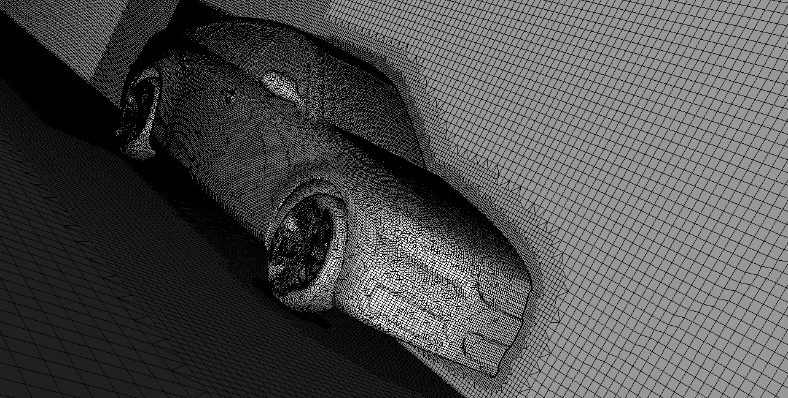

# Hex-dominant mesher

  Generate mesh using a background cartesian grid.

{: .zoom .image-wrapper }

The HEX-dominant mesher is a meshing tool based on using a background cartesian grid with which one or more surfaces intersect to define the domain of interest for the simulation. The tool is based on the [snappyHex](https://github.com/OpenFOAM/OpenFOAM-dev/tree/master/applications/utilities/mesh/generation/snappyHexMesh) utility in [OpenFOAM](https://en.wikipedia.org/wiki/OpenFOAM).

OpenFOAM (for "**Open**-source **F**ield **O**peration **A**nd **M**anipulation") is a C++ toolbox for the development of customized numerical solvers, and pre-/post-processing utilities for the solution of continuum mechanics problems, most prominently including computational fluid dynamics (CFD)[^1].

## Meshing procedure

The steps followed by the `snappyHexMesh` utility can be summarized as:

1. **Background mesh is created**:  
   Based on the parameters defined by the user, the background cartesian mesh is created. The details of the input parameters are discussed in the [Background mesh](./background_mesh.md) step.
1. **Cells and nodes are categorized**:  
   Based on the geometry input (for example using an STL/OBJ file) by the user (see the [Geometries](/geometry.md) step), the utility categorizes the cells and nodes of the background mesh according to their relative location to the boundaries of the input geometric surface or surfaces.
1. **Computational domain is selected**:  
   The utility identifies which of the formed domains is of interest according to the [material point](/material_point.md) location.
1. **Castellation is conducted**:  
   The utility retains only the cells which have roughly 50% or more of their volume inside the domain of interest. Other cells are deleted. 
1. **Snapping is executed**:  
   The cells which are close to the boundaries of the geometric surface are split based on the snapped points from the geometric surface. The purpose of this step is to create cells that are body fitted to the geometric surface. 
   Note that this step and the previous one occur with minimal interference from the user. However, some of the parameters defined by the user can affect these processes.
1. **Volume refinement is applied**:  
   The generated mesh is then refined according to the setup of the [edge](/edge_refine.md), [surface](/surface_refine.md) and [volume](/volume_refine.md) refinement requirements.
1. **Layering is performed**:  
   Finally, the cells adjacent to the geometric surface are modified to satisfy the [boundary layer](/boundary_layer.md) requirements. Additional layers in the boundary region are created.

[^1]: Src: [OpenFOAM entry on Wikipedia](https://en.wikipedia.org/wiki/OpenFOAM)
