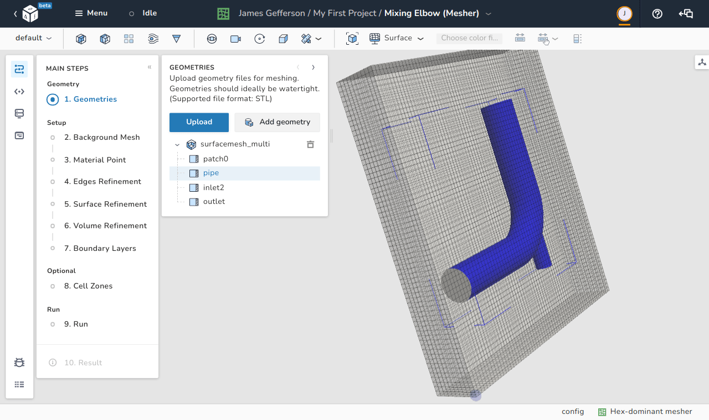

# Main steps

  Follow simple meshing steps to generate your mesh.

{ .zoom .image-wrapper }

To simplify and lower the barrier of entry for new users, in dicehub you can easily 
setup your case with the following steps:

1. **Geometries**:  
   [Add or import geometry for meshing](./geometries.md)
1. **Background Mesh**:  
   [Define the extent of the computational domain and a base level mesh density.](./background_mesh.md)
1. **Material Point**:  
   [Specify the point location in the enclosed area where mesh cells are generated](./material_point.md)
1. **Edges refinement**:  
   [Resolve sharp angles with edges refinement.](./edges_refinement.md)
1. **Surface refinement**:  
   [Apply surface refinement on to the geometry.](./surface_refinement.md)
1. **Volume refinment**:  
   [Apply volume refinement to specific regions.](./volume_refinement.md)
1. **Boundary Layers**:  
   [Add layers close to the surface.](./boundary_layers.md)
1. **Cell Zones**:  
   [Add cell zones](./cell_zones.md)
