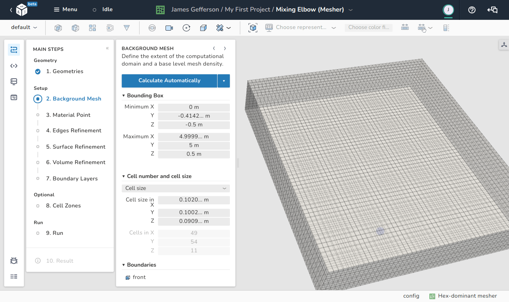
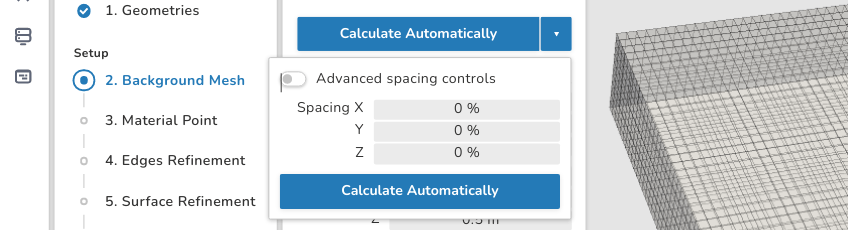
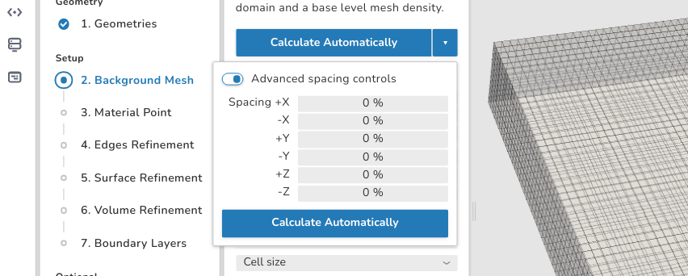
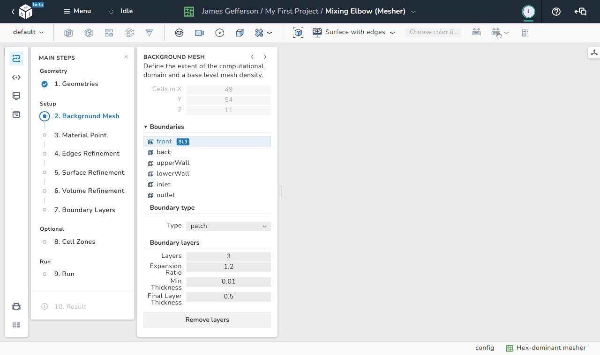

# Background mesh

In this step, the background mesh is created.

<figure Markdown>
  { .zoom .image-wrapper }
  <figcaption>View of the background mesh step</figcaption>
</figure>

For the  background mesh a bounding box is generated. During this procedure the 
OpenFOAM utility [blockMesh](https://github.com/OpenFOAM/OpenFOAM-dev/blob/master/src/mesh/blockMesh/blockMesh/blockMesh.C) is used.

!!! note
    Other more complex background meshes are allowed but are not
    covered in this case.   
    They can be generated with blockMesh or any other meshing utility.

## Bounding box

The bounding box can be defined automatically or manually. 
It should surround all imported/created geometries of interest.

### Automatically setting bounding box limits

This option relies in the spatial limits of the input geometries. The geometries
surfaces cn be regarded as a list of points in a three-dimensional space with
coordinates $\left(x_i, y_i, z_i \right)$ with $i$ being the order of the 
geometric point. We can define a bounding box based on two points, $B_{min}$ 
and $B_{max}$, defined as:

$B_{min}=(\min(x_i), \min(y_i), \min(z_i)),$  
$B_{max}=(\max(x_i), \max(y_i), \max(z_i)).$

These two points represent the diagonal of the bounding box and are computed 
automatically by just using the **Calculate Automatically** button.
If the user wishes to increase the size of the auto-calculated domain size based 
on $B_{min}$ and $B_{max}$, there exist two levels of options for spacing both 
placed under the drop-down menu beside the **Calculate Automatically** button.

=== "Simple spacing options"
    {: .zoom .image-wrapper }

=== "Advanced spacing options"
    {: .zoom .image-wrapper }

In the spacing options you can define the magnification percentages $\left(\beta_x,\beta_y,\beta_z\right)$ for each direction.

For example if the size of the background mesh domain in the $x$ direction is 
increased by $10\%$,its size is computed from $B_{min}$ and $B_{max}$ in each of
the positive and negative $x$ directions. The same applies to the $x$ and $y$ 
direction. Negative values for $\beta$ are not allowed.

### Manually setting bounding box limits

User can also manually enter the coordinates of the points $B_{min}$ and 
$B_{max}$. 

!!! caution
    Care should be taken not to exclude parts of the geometric surface 
    of interest because these parts will also be excluded by the mesher.

### Changing boundary types of the bounding box

<figure Markdown>
  {: .zoom .image-wrapper }
  <figcaption>Bounding box boundaries</figcaption>
</figure>

In this part, the boundaries of the background mesh are defined. First, 
selecting one of the boundaries enables the option to rename them to have 
helpful indicative names during the simulations. The default names of the six 
boundaries of the background mesh are:

- front
- back
- upperWall
- lowerWall
- inlet
- outlet

The default type is **patch** for all the boundaries. Beside the type, the user 
can establish layers on each boundary in the same sense of the boundary layers 
on a geometric surface. The function of these options can be summarized as:

1. **Layers**: Indicates the number of layers built on top of this boundary.
1. **Expansion Ratio**: Represents the ratio of the geometric series of the 
   layer sizes. If for example the ratio is 1.2, then each layer thickness is 
   1.2 times its predecessor's thickness.
1. **Min Thickness**: This entry provides the meshing utility with a minimum 
   layer thickness to avoid too thin layers over the surface.
1. **Final Layer Thickness**: This entry defines the thickness of the final 
   layer of the boundary layer.

Finally, beside the name of each boundary, a logo specifying the number of 
layers is shown. In the above image, the logo `BL3` is added as 3 layers are 
specified for this boundary. The **Remove Layers** button deactivates the 
creation of layers on this boundary.
