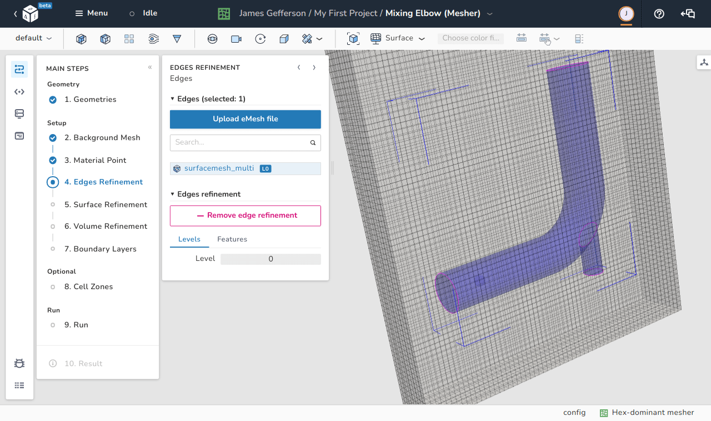
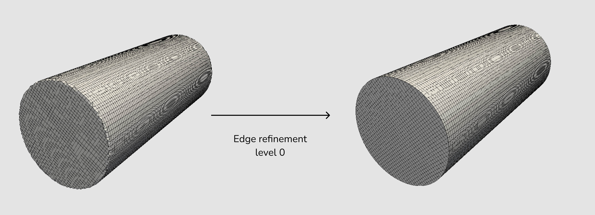
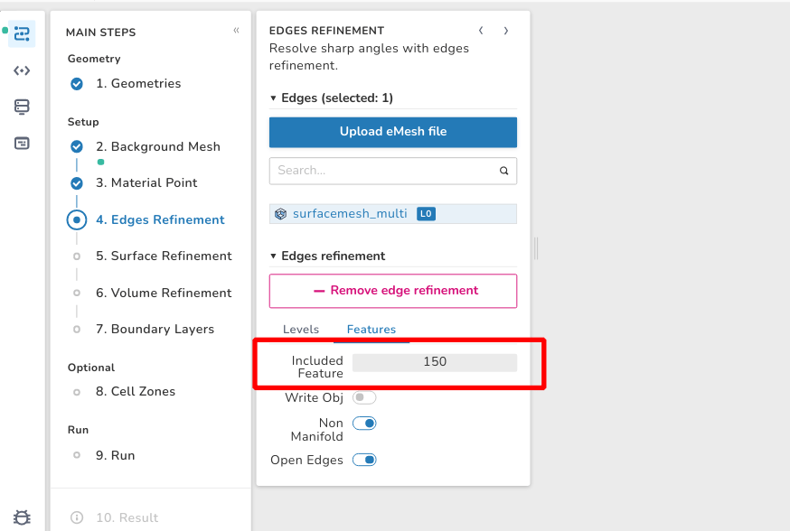
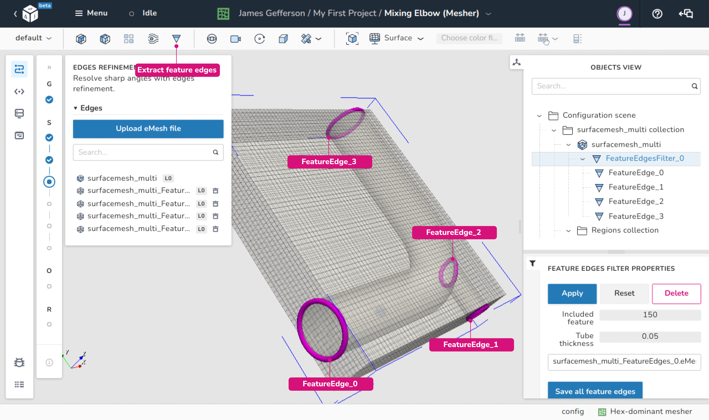

# Edges refinement

In order to preserve the main features of the simulated geometric surface, it is 
important to inform the meshing utility which edges are important to preserve. 
These edges are typically sharp edges that give the geometric surface its 
identity like the circumferences of the two circles defining a cylinder. 

<figure Markdown>
  { .zoom .image-wrapper }
  <figcaption>View of the edges refinement step</figcaption>
</figure>

As shown in the image below, trying to create a mesh inside a cylinder without 
edges refinement does not capture the sharp edges of the cylinder very well. 
Even setting edges refinement to the `level 0` results in a massive improvement.

<figure Markdown>
  { .zoom .image-wrapper }
  <figcaption>Without (left) and with (right) edges refinement</figcaption>
</figure>

## Methods to define edges for refinement

In dicehub the following methods can be used to define edges for refinement:

- By using the OpenFOAM feature edges extraction utility `surfaceFeatures`.
- By uploading a custom eMesh file.
- By using the feature edges extract filter.

### Use the surfaceFeatures utility

In this method the OpenFOAM utility [surfaceFeatures](https://github.com/OpenFOAM/OpenFOAM-dev/blob/master/src/meshTools/triSurface/surfaceFeatures/surfaceFeatures.C) 
generates the feature edges automatically. The `includedAngle` controls the
feature edges extraction and can be specified in the **Features** options tab
when selecting a surface in the edges refinement step.

By clicking on **Add edge refinement**, two tabs (`Levels` and `Features`) show 
up. The selected edges for refinement causes splitting of the cells sharing 
these edges. The level of this division indicates the number of cells into which 
the original cell is divided into as an exponent of 2. So for example, level 1 
divides the original cell into 2 cells ($2^1$), while a level 3 splits the cell 
into 8 ($2^3$) cells.

The **included angle** specifies a threshold for the angle any two neighboring edges can make. If the included angle between these two edges is less than the threshold, these edges are marked for refinement.

To change the `includedAngle`:

=== "Description"
      1. Select the **Edges Refinement** step.
      1. Select the **surface** where edges refinement is necessary.
      1. In the **Edges refinement** options select the **Features** tab.
      1. Change the **Included Feature Angle**.

=== "Images"
    <figure Markdown>
      { .zoom .image-wrapper }
      <figcaption>Included angle for surfaceFeatures utility</figcaption>
    </figure>

Additional available options:

- **Write Obj**: This switch can be used to export the results of the edges
  refinement identification process as an **obj** file.
- **Non Manifold**: This switch can be used to tell the meshing utility to keep
  the [non-manifold](https://knowledge.autodesk.com/support/maya/learn-explore/caas/CloudHelp/cloudhelp/2016/ENU/Maya/files/GUID-8E97CEF7-1CFE-4838-B4B7-59F526E21AB2-htm.html) edges. Generally, a non-manifold edge is an edge with more than two 
  connected faces and the faces have more than two different planes.
- **Open Edges**: The purpose of this switch is to keep open edges which are 
  edges that have only one connected face.

### Upload a custom eMesh file

One way of defining edges of refinement is to provide eMesh files for the 
meshing utility. The eMesh files can be created using the OpenFOAM [surfaceFeatures](https://github.com/OpenFOAM/OpenFOAM-dev/blob/master/src/meshTools/triSurface/surfaceFeatures/surfaceFeatures.C) utility or by using any other software supporting 
this file extension, for example Paraview or Blender. The eMesh files can be uploaded by 
using the **Upload eMesh file** button.

### Use the feature edges extract filter

It is not mandatory to use the whole geometric surface of a loaded STL file to 
create an edge refinement with unified settings. The user can use the 
**extract feature edges** filter to specify different settings for different 
surfaces. 

To extract feature edges follow these steps:

=== "Description"
      1. Open the **Objects view** on the right.
      1. Select the STL file in the **Regions collection** where feature edges are to be extracted.
      1. Apply the filter by clicking on the **Extract feature edges** icon in the toolbar.
      1. Select the created **FeatureEdgesFilter** in the objects view.
      1. Play around with the **includedAngle** to capture the edges of interest.
      1. Either **upload all feature edges as one eMesh file** or go through every
         available FeatureEdge item and **save it separately**.
      1. After saving the eMesh files go to the edges refinement step, select the newly
         added eMesh files and set the level of refinement.

=== "Images"
    <figure Markdown>
      { .zoom .image-wrapper }
      <figcaption>Extract feature edges filter</figcaption>
    </figure>

!!! tip
    Use the `tube-thickness` in the feature edges filter properties to better 
    visualize the feature edges. The tube thickness is available for 
    visualization purposes as it specifies the thickness of the highlighting 
    tube of the detected edge.
