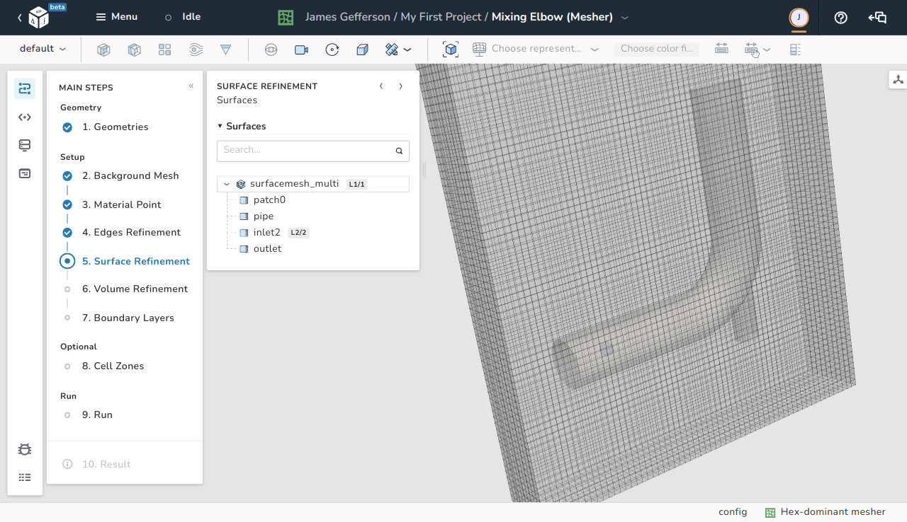
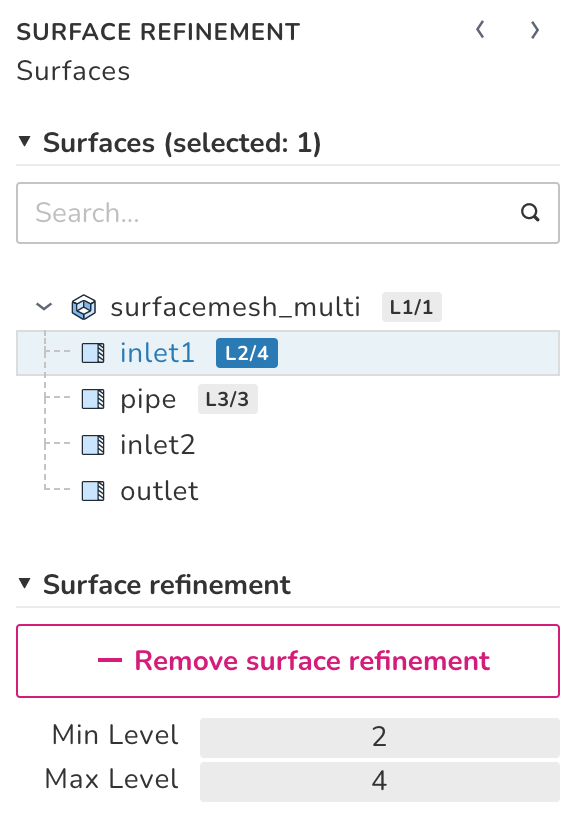

# Surface refinement

<figure Markdown>
  { .zoom .image-wrapper }
  <figcaption>View of the surface refinement step</figcaption>
</figure>

The user can specify the level of refinement for each surface named in the STL file. Similar to the [edges refinement](./edges_refinement.md) step, the level of refinement represents the number of cells resulting from splitting an original cell by an exponent of $2$ (level $2$ means $4$ cells).

!!! note
    
    It is very important to note that not adding any surface refinement to the model makes the meshing engine ignore the added geometry altogether and output the background mesh only.

## The surface refinement menu

<figure Markdown>
  { .zoom .image-wrapper width="300" }
  <figcaption>View of the surface refinement step</figcaption>
</figure>

The surface of refinement is defined by a minimum and a maximum level of refinement. The minimum level is dedicated to all the cells that have an intersection with the STL surface. The maximum level is dedicated to cells which have multiple intersections with STL surfaces and the intersections happen at angles greater than the **Resolve Feature Angle** defined in the [advanced options menu](./advanced_options.md).

Each surface that was assigned a refinement has a logo with the letter **L** and the minimum and maximum levels of refinement. It is also possible to define global surface refinement levels for all the surfaces/regions in an STL file.

In the above image, the global surface refinements levels for all the surfaces in the **surfacemesh_multi** file is $1$ and $1$. However, it is possible to override those values by specifying local levels. In the image, **inlet1** and **pipe** have their own levels which have higher priority than the STL global levels.

The **Remove surface refinement** button can be used to remove any local and/or global added refinement level.
