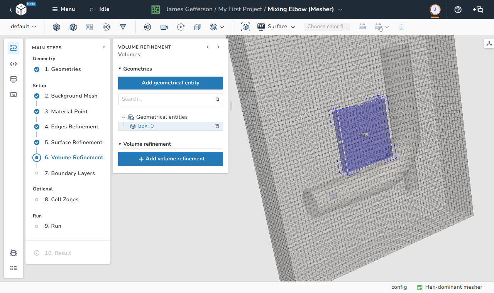
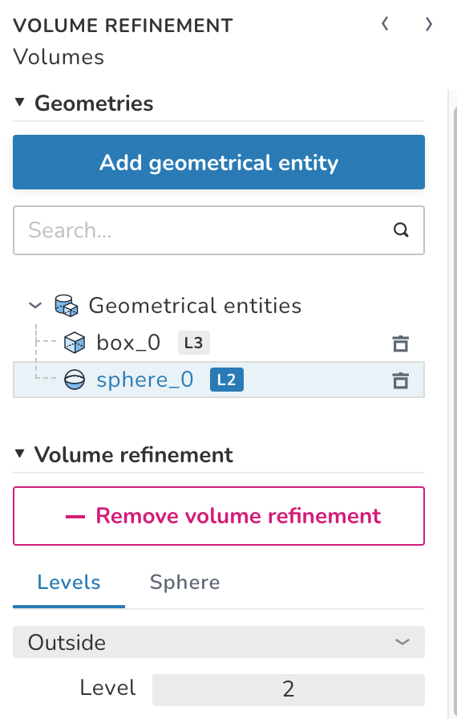
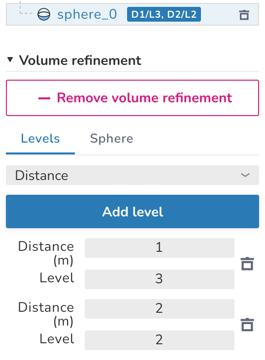

# Volume refinement

<figure Markdown>
  { .zoom .image-wrapper }
  <figcaption>View of the volume refinement step</figcaption>
</figure>

In this step, the user can apply refinement to some cells according to some user-set criteria. The volume refinement is applied to the geometric entities loaded in the [Geometries](./geometries.md) step and/or newly loaded entities via the **Add geometrical entity** button as shown in the below image.

Selecting a geometric entity and using the **Add volume refinement** creates the sub-menu shown in the below image. For each geometric entity, the user should specify the Levels of refinement for this entity as well as specify or modify the geometrical properties of the entities (In the shown image, a **sphere** entity is selected so a **sphere** sub-menu is visible to control its location and radius).

<figure Markdown>
  { .zoom .image-wrapper width="300" }
  <figcaption>View of the volume refinement object menu</figcaption>
</figure>

There are three different types of defining the refinement criteria:

1. **Inside:** for this type, all the cells that lie inside the geometric entity are subject to refinement according to the specified level. Similar to [edges](./edges_refinement.md) and [surface](./surface_refinement.md) refinements, the levels are expressed as an exponent of $2$.
1. **Outside:** same as **Inside**, but for cells that are outside the entity.
1. **Distance:** all the cells that are within a specific distance from the surface of the entity are subject to this refinement. In this option, multiple distances can be applied to make, for example, the cells that are closer to the surface finer than the those that are further. The distances need to be ordered by the closest first, and each distance can have its own level of refinement as shown in the below image.

<figure Markdown>
  { .zoom .image-wrapper width="300" }
  <figcaption>Using distance to define volume refinement levels</figcaption>
</figure>
