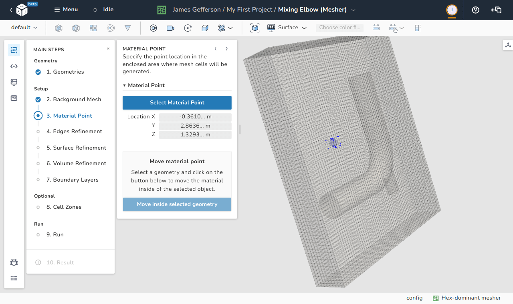

# Material point

In this step, the user is required to identify the location of the material point. 
The material point is used to identify the subdomains of interest out of the domains created by intersecting the [background mesh](./background_mesh.md) with the [geometric surfaces](./geometries.md) in the model. The subdomain which contains the material point is kept and all other subdomains are deleted.

<figure markdown>
  { .zoom .image-wrapper }
  <figcaption>View of the material point step</figcaption>
</figure>

The user should place the material point at any location inside the subdomain that needs to be meshed. The location of the point is arbitrary as long as it falls within the boundaries of this subdomain.

There are two methods of defining the location of the material point. The first method is by typing in the desired coordinates as shown in the image. The second method is clicking the **Select Material Point** button and then dragging the point to the location of interest.

!!! note
    After you upload a geometry the material point is automatically placed inside
    the bounding box in one of the corners.
  
!!! tip
    You can select a geometry and use the **Move inside selected geometry** function
    to place in the center of the bounding box of the selected geometry. 
    The same works if you select one of the sides of the bounding box.

    Keep in mind the for complex geometries the center of the bounding box for the
    geometry could be actually outside of the geometry.
